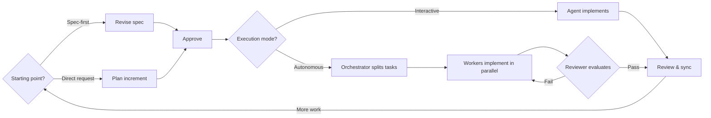

# EsperKit

[](https://www.npmjs.com/package/esperkit)

Tool-neutral workflow layer for spec-driven software development. Gives coding agents a durable project constitution, system specs, structured increments, bounded multi-agent execution, and verifiable delivery rules.

Works with Claude Code and Codex. Supports single-agent interactive work and multi-agent autonomous runs across providers.

## Install

```bash
npm install -g esperkit
esperkit install
```

To install skills into the current project instead of the global agent directory:

```bash
esperkit install --project
```

Then initialize through the agent:

```
esper:init
```

This interviews you, creates the `.esper/` directory with a constitution, spec scaffolding, and workflow config.

## Uninstall

Remove all esper skills from the agent directory:

```bash
esperkit uninstall
```

Supports `--provider claude|codex|all` to target specific hosts.

## Workflows

EsperKit supports two complementary development styles. Spec-to-Code supports both interactive (single-agent) and autonomous (multi-agent) execution.



**Spec-to-Code** — define or revise the system spec first, then derive implementation from it.

```
esper:spec    →  open or create the spec working file, revise with the agent
esper:go      →  approve spec and begin execution (no second approval gate)
esper:review  →  verify implementation
```

**Plan-to-Spec** — start from a direct request, implement in bounded increments, then sync back into specs.

```
esper:atom    →  single bounded task (or esper:batch for a queue)
esper:go      →  approve plan, implement
esper:review  →  verify implementation
esper:sync    →  force spec sync if needed (usually automatic)
```

Both workflows use `esper:go` as the shared approval gate and `esper:continue` to resume interrupted sessions.

## Commands

| Command | What it does |
|---|---|
| `esper:init` | Interview, scaffold project, write constitution |
| `esper:spec` | Open or create the spec working file for authoring and revision |
| `esper:atom` | Create a single bounded increment from a direct request |
| `esper:batch` | Create a queued series of related increments |
| `esper:go` | Cross the active approval boundary and advance the workflow |
| `esper:continue` | Resume interrupted work from current project state |
| `esper:review` | Verify implementation against the approved plan and specs |
| `esper:sync` | Force or retry post-implementation code-to-spec sync |
| `esper:context` | Show current project state and next safe action |

Use the same `esper:*` command names across hosts, including Claude Code and Codex.

### CLI

| Command | What it does |
|---|---|
| `esperkit install` | Install or update host-specific skills |
| `esperkit install --project` | Install skills into the current project |
| `esperkit uninstall` | Remove esper skills from agent directory |
| `esperkit init` | Create deterministic project scaffolding |
| `esperkit config` | Read or write project config |
| `esperkit context get` | Print runtime context as JSON |
| `esperkit spec` | Manage the spec tree (index, get, create, set-root, archive) |
| `esperkit increment` | Manage increments (list, get, create, activate, finish, set, group) |
| `esperkit run` | Manage autonomous runs (create, get, list, stop) |
| `esperkit doctor` | Run project health checks |
| `esperkit migrate` | Migrate project state to the latest schema |

## Core Concepts

**Constitution** — durable project-level document describing what the project is and is not, key technical decisions, testing strategy, and principles.

**Specs** — long-lived system description for agents and humans. Architecture, behavior, interfaces, constraints. Not temporary task notes.

**Increments** — bounded units of delivery. Each stores what will change, why, how to verify it, and which specs it touches. Single-job mode (one atomic increment) or queued mode (a series of increments processed sequentially).

**Runs** — machine-readable autonomous execution records derived from an approved scope contract and its corresponding parent increment.

**Task packets** — bounded work items inside a run, subordinate to the parent increment.

**Working file** — the Markdown file that serves as the shared review surface between you and the agent. Chat, edit directly, or leave comments inside it.

## Project Structure

```
.esper/
├── esper.json              # project config and workflow preferences
├── context.json            # machine-readable runtime state
├── CONSTITUTION.md         # project vision and constraints
├── WORKFLOW.md             # agent bootstrap instructions
├── increments/
│   ├── pending/            # queued work
│   ├── active/             # current working increment (max 1)
│   ├── done/               # completed, not yet archived
│   └── archived/           # closed historical increments
└── runs/                   # autonomous execution records
    └── <run-id>/
        ├── run.json
        ├── tasks/
        └── reviews/

<spec_root>/                # default: specs/
├── index.md                # spec tree entrypoint
├── _work/                  # temporary spec coordination files
└── ...                     # organized by domain
```

## Choosing the Right Entry

| Situation | Command |
|---|---|
| Architecture or behavior needs design before coding (approved spec goes directly to execution) | `esper:spec` |
| Small, bounded task with a known outcome | `esper:atom` |
| Multiple related changes that should be queued | `esper:batch` |
| Returning after a break or state is unclear | `esper:context` |

## Design Principles

- **Tool-neutral first** — project state must remain readable without dependence on one vendor runtime
- **Specs are durable** — the spec tree must live in files, be revisable, and stay aligned with shipped behavior
- **One contract at a time** — in Spec-to-Code, the approved spec is authoritative; in Plan-to-Spec, one parent increment is authoritative
- **Frozen inputs for autonomy** — autonomous runs review against persisted artifacts, not conversation history
- **Bounded autonomy** — automated loops require explicit stop conditions and escalation rules
- **Human-readable behavior** — the spec tree must make intended and current behavior easy for a user to inspect quickly

## Docs

- [User Manual](docs/esperkit-user-manual.md) — day-to-day usage guide covering both workflows, all commands, and best practices
- [Spec Index](specs/index.md) — entrypoint to the split spec tree covering core, workflow, state, CLI, skills, and patterns

## License

MIT
