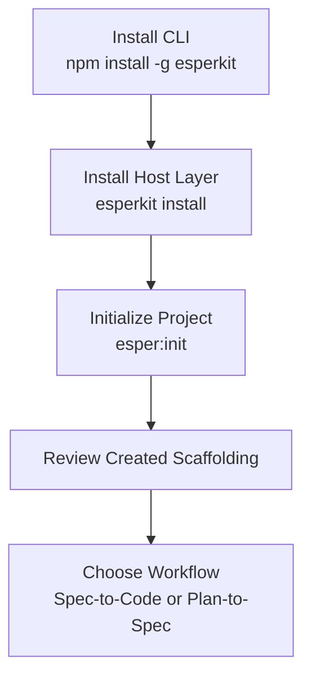
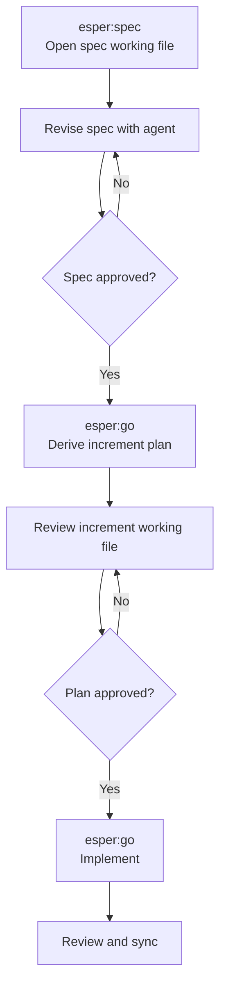
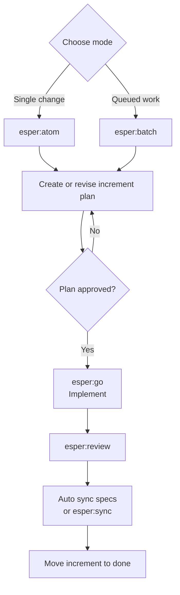
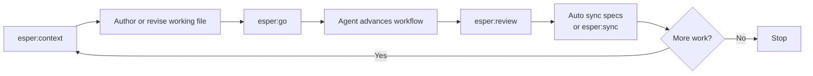

# Esperkit User Manual

This manual introduces the revised Esperkit workflow for AI-assisted software development.
It tracks the workflow model defined in `specs/esperkit-spec.md`.
It is written for day-to-day users who want to understand how Esperkit works, when to use each command, and what files Esperkit manages in the repository.

Esperkit supports two working styles:

- Spec-to-Code: define or revise the system spec first, then derive implementation work from it.
- Plan-to-Spec: start from a direct request, implement in bounded increments, then sync the shipped result back into the spec.

## What Esperkit Is

Esperkit has two parts:

- The `esperkit` CLI, which performs deterministic setup and state changes.
- A host instruction layer, exposed as skills or slash commands, which guides the AI agent through planning, review, execution, and sync.

The CLI owns durable project state on disk.
The instruction layer owns the collaborative workflow.

## Core Ideas

### 1. Constitution

The constitution is the durable project-level contract. It explains:

- what the project is
- what the project is not
- key technical decisions
- testing and delivery rules

### 2. Specs

Specs are the long-lived system description for humans and agents.
They describe architecture, behavior, interfaces, and constraints.
They are not temporary task notes.

### 3. Increments

An increment is a bounded unit of work.
It stores the implementation plan, progress, verification notes, and links back to the relevant specs.

### 4. Working File

Every meaningful step in Esperkit centers on a Markdown working file.
That file is the shared review surface between you and the agent.

Examples:

- a spec file
- a temporary spec coordination file under `_work/`
- an active increment file

## Command Surface

Esperkit uses a small set of primary commands.
The exact syntax depends on the host:

- Claude-style slash commands: `/e:init`, `/e:spec`, `/e:atom`
- Skill-style names: `esper:init`, `esper:spec`, `esper:atom`

This manual uses the `esper:*` form, but the workflow is the same.

## Installation and First-Time Setup

### Install the CLI

```bash
npm install -g esperkit
```

This installs the global `esperkit` executable.

### Install the Host Instruction Layer

In the repository root:

```bash
esperkit install
```

This installs or updates the host-specific skills or slash-command assets.
It does not create project workflow files yet.

### Initialize the Project

Run the initialization workflow through the host:

```text
esper:init
```

`esper:init` should gather your workflow preferences, call `esperkit init`, and create the local scaffolding.

Typical generated artifacts:

- `.esper/context.json`
- `.esper/WORKFLOW.md`
- `.esper/CONSTITUTION.md`
- `.esper/increments/pending/`
- `.esper/increments/active/`
- `.esper/increments/done/`
- `.esper/increments/archived/`
- the spec root and its `_work/` coordination area

### Setup Flow



## Workflow 1: Spec-to-Code

Use this when you want the spec to be the source of truth before coding begins.

### Step 1. Open or Create the Spec Working File

Run:

```text
esper:spec
```

The agent should:

- read current project context
- open the relevant spec files when possible
- create a temporary `_work/<topic>.md` file when the change spans multiple specs
- keep the review loop centered on Markdown

### Step 2. Revise the Spec Until It Is Accurate

Stay in the spec loop until the spec describes the intended system behavior.

You can provide feedback by:

- chatting with the agent
- editing the spec file directly
- leaving comments in the working file

### Step 3. Approve the Spec and Derive an Increment Plan

Run:

```text
esper:go
```

When the active working file is a spec file, `esper:go` means:

- approve the current spec work
- derive an implementation plan
- create an atomic increment or a batch queue
- stop at plan review, not coding

### Step 4. Review the Derived Increment

The agent creates or updates the active increment Markdown file.
You review and revise that plan until it is acceptable.

### Step 5. Approve the Increment and Start Implementation

Run `esper:go` again.

When the active working file is now an increment file, `esper:go` means:

- approve the plan
- begin implementation
- validate changes
- keep specs aligned if behavior changes

### Spec-to-Code Flow



## Workflow 2: Plan-to-Spec

Use this when you want to start from a direct request and let Esperkit structure the work from there.

There are two entry modes:

- `esper:atom` for one bounded task
- `esper:batch` for a queued series of related increments

### Atomic Mode

Run:

```text
esper:atom
```

This is the standard path for a single feature, fix, or small change.

The agent should:

- create or open the active increment working file
- translate your request into an implementation plan
- stop in plan-review mode until you explicitly approve

### Batch Mode

Run:

```text
esper:batch
```

Use batch mode when the work should be split into a queue.

The agent should provide a queue preview that shows:

- planned increments
- execution order
- high-level scope of each increment
- expected spec impact
- validation approach

### Approve and Implement

After the increment plan or batch queue is acceptable, run:

```text
esper:go
```

That approval advances the active increment into implementation.

### Review the Result

Run:

```text
esper:review
```

This performs an explicit verification pass against:

- the approved increment file
- the relevant spec files
- the delivered implementation

### Sync the Result Back Into the Specs

This should normally happen automatically after implementation.

Run this only when you want to force, retry, or explicitly inspect the sync step:

```text
esper:sync
```

`esper:sync` updates the specs so they match what actually shipped.
That explicit sync step is the fallback when automatic sync did not run or you want to confirm it.

### Plan-to-Spec Flow



## Shared Daily Loop

Once a project is initialized, the day-to-day loop is simple:

1. If you are unsure of the current state, run `esper:context`.
2. Create or revise the current working file through `esper:spec`, `esper:atom`, or `esper:batch`.
3. Run `esper:go` to approve the current working file and advance to the next stage.
4. Use `esper:review` for explicit implementation verification.
5. Let the agent sync specs automatically after implementation, and use `esper:sync` only when you need to force or retry that step.
6. Resume later with `esper:continue` when needed.

### Daily Loop Flow



## Primary Commands

### `esper:init`

Initializes Esperkit in the current repository and creates project scaffolding.

### `esper:spec`

Main entrypoint for spec authoring and spec revision.
Use this when the spec should lead the work.

### `esper:go`

Shared approval command.
It approves the current working file and advances the workflow.

- If the active file is a spec: derive the increment plan.
- If the active file is an increment: start implementation.

### `esper:context`

Summarizes current project state, including:

- active increment
- spec root
- likely next safe action

### `esper:atom`

Main entrypoint for one bounded unit of direct-request work.

### `esper:batch`

Main entrypoint for queued, multi-increment work.

### `esper:review`

Runs a focused review against the approved plan and relevant specs.

### `esper:sync`

Runs an explicit code-to-spec sync pass.
Use it when you need to force or retry syncing the shipped implementation back into the specs.

### `esper:continue`

Resumes work from current project state without rebuilding context manually.

## What Esperkit Writes in the Repo

A typical repository layout looks like this:

```text
.esper/
├── context.json
├── WORKFLOW.md
├── CONSTITUTION.md
├── increments/
│   ├── pending/
│   ├── active/
│   ├── done/
│   └── archived/
└── ...

<spec_root>/
├── _work/
└── ...
```

### Increment States

- `pending/`: queued work not yet active
- `active/`: current working increment
- `done/`: completed increments not yet archived
- `archived/`: closed historical increments

## How to Choose the Right Entry Command

Use `esper:spec` when:

- you are changing architecture
- the behavior needs to be designed before coding
- multiple components need a coherent contract first

Use `esper:atom` when:

- the task is small and bounded
- you already know the requested outcome
- one increment is enough

Use `esper:batch` when:

- the work naturally breaks into a queue
- order matters
- you want one reviewed execution plan for several related changes

Use `esper:context` when:

- you are returning to a project after a break
- the active stage is unclear
- you want the next safe action before editing anything

## Best Practices

- Treat the Markdown working file as the source of truth for the current step.
- Do not skip `esper:go`; approval is the stage transition.
- Use `esper:review` when you want an explicit verification pass, even if the agent already ran tests.
- Expect spec sync to happen automatically after implementation; use `esper:sync` when you need to force or retry it.
- Prefer `esper:atom` for small changes and `esper:batch` only when the queue is genuinely useful.
- Use `esper:continue` instead of re-explaining context to the agent.

## Common Mistakes

### Editing Code Before the Plan Is Approved

If you are still revising the increment file, stay in the planning loop.
Use `esper:go` only when you want execution to begin.

### Letting Specs Drift After Plan-First Work

If you used `esper:atom` or `esper:batch`, remember that code alone is not the final artifact.
The agent should normally sync specs automatically. If that did not happen, run `esper:sync` to bring the spec back in line with what shipped.

### Starting a Batch for a Single Small Task

If the work does not need a queue, use `esper:atom`.
Batch mode adds coordination overhead by design.

## Quick Start Examples

### Example A: Spec-First Feature

```text
esper:init
esper:spec
esper:go
esper:go
esper:review
esper:sync   # optional: force a final code-to-spec pass
```

### Example B: Direct Small Change

```text
esper:atom
esper:go
esper:review
esper:sync   # optional: force or retry spec sync
```

### Example C: Queued Delivery

```text
esper:batch
esper:go
esper:review
esper:sync   # optional: force or retry spec sync
```

## Mental Model

Esperkit is easiest to use if you remember three rules:

1. Every major step happens around a Markdown file.
2. `esper:go` is the approval gate that advances the workflow.
3. Specs must stay aligned with shipped code.

If you follow those rules, the rest of the command set stays small and predictable.
