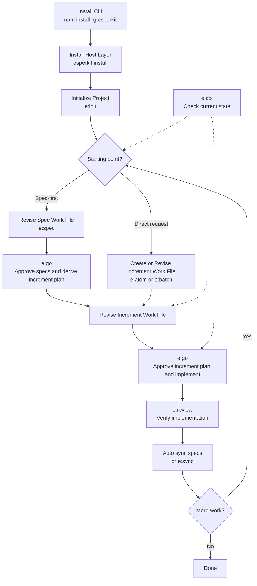

# EsperKit Product Spec

Status: Draft
Date: 2026-02-28

## Summary

EsperKit is a tool-neutral workflow layer for AI-assisted software development. It has two product parts:

1. A CLI toolkit for installation, deterministic project-initialization primitives, local project-state management, and direct usage by coding agents.
2. A skills and slash-command layer that gives coding agents operational instructions for how to use EsperKit inside supported hosts.

Together, these two parts provide a durable project constitution, agent-facing system specs, structured increment artifacts, and verifiable delivery rules that can be used from coding agents, vibe-coding IDEs, and future external tools.

EsperKit must support two complementary SDD workflows:

1. Spec-to-Code: users shape and revise specs first, then coding agents plan and implement against those specs.
2. Plan-to-Spec: users tell coding agents what they want directly, coding agents plan and implement the change, then sync the shipped increment back into specs.

The product must remain extendable and hackable. It cannot assume a single host environment, a single agent tool model, or a single interaction primitive.
It should be explicitly AI-native: easy to use, proactive, and smart enough to reduce manual orchestration overhead for the user.
Its core review loops should be centered on Markdown work files that both the user and the coding agent can read and revise.

## Workflow Usage

This section is the source of truth for EsperKit behavior. Later sections define the artifacts, commands, and requirements needed to support this workflow and should not contradict it.

### 1. Install EsperKit Globally

The user installs the CLI toolkit globally:

```bash
npm install -g esperkit
```

This installs the `esperkit` CLI, which is the local entrypoint for:

- installing host-specific skills and slash commands
- initializing EsperKit in a project
- managing deterministic project state and scaffolding

Artifacts:

- created outside the repo: global `esperkit` CLI install
- no repository files are created or changed yet

### 2. Install the Instruction Layer for the Current Host

In the target repository, the user runs:

```bash
esperkit install
```

This installs or updates the host-specific skills and slash-command assets used by coding agents in the current environment.

The CLI performs installation only. It does not analyze the codebase or author specs.

Artifacts:

- created or changed: host-specific instruction assets for the current environment
- no spec files or increment files are authored here

### 3. Initialize EsperKit in the Project

In the repository root, the user normally invokes the initialization skill or slash command, not the CLI directly.

Examples:

- `/e:init`
- `esper:init`

That instruction-layer workflow should:

- ask the user for workflow preferences, including commit, PR, validation, and default work-mode behavior
- call `esperkit init` as the deterministic setup primitive
- explain the created scaffolding

The underlying CLI operation is:

```bash
esperkit init
```

This creates the deterministic project scaffolding:

- `.esper/`
- `.esper/CONSTITUTION.md` or equivalent constitution file
- config and schema state
- `.esper/context.json`
- `.esper/WORKFLOW.md` or equivalent bootstrap instructions
- `.esper/increments/pending/`
- `.esper/increments/active/`
- `.esper/increments/done/`
- `.esper/increments/archived/`
- the initial spec-tree directories under `spec_root`
- placeholder or template files in the spec tree

At this point, EsperKit is initialized, but the specs are still scaffolding rather than a reviewed description of the current system.

Artifacts:

- created: `.esper/`
- created: `.esper/context.json`
- created: `.esper/WORKFLOW.md`
- created: `AGENTS.md`
- created: `CLAUDE.md`
- created: `.esper/CONSTITUTION.md` or equivalent constitution file
- created: `.esper/increments/pending/`
- created: `.esper/increments/active/`
- created: `.esper/increments/done/`
- created: `.esper/increments/archived/`
- created: `<spec_root>/`
- created: `<spec_root>/_work/`
- created: template spec files under `<spec_root>/`
- changed: project config state with workflow preferences

### A. Spec-to-Code Workflow

This is the workflow where the spec is the primary source of truth before implementation starts.

#### 4. Open the Spec Work File

The user opens the relevant spec work file directly or through a spec-oriented helper workflow.

Examples:

- edit the target spec files directly
- use `/e:spec`
- use `esper:spec`

The coding agent must center the review loop on a Markdown work file.

Default rule:

- if the change is confined to one or a few existing spec files, the relevant spec files are the work files
- if the change spans multiple specs, bootstraps a spec tree from code, or needs staging before landing, the agent should create a temporary coordination file under `<spec_root>/_work/<topic>.md`

The user can either:

- chat with the agent normally
- edit the Markdown work file directly
- add comments directly inside the file

The agent must read and resolve user comments from the Markdown work file before proceeding.

Artifacts:

- changed: one or more spec files under `<spec_root>/`
- optionally created: `<spec_root>/_work/<topic>.md` as a temporary spec coordination file
- unchanged: increment files

#### 5. Revise the Specs With the Coding Agent

The user and coding agent continue using that Markdown work file in a review-and-revise loop until the spec tree accurately describes how the system should work.

This loop should focus on:

- architecture
- behavior
- interfaces
- data and state flows
- missing or uncertain areas

If a temporary coordination file was used, the agent should land the approved changes into the actual spec files before implementation starts.

Artifacts:

- changed: the active spec work file
- changed: finalized spec files under `<spec_root>/`
- optionally removed: `<spec_root>/_work/<topic>.md` after its contents are landed

#### 6. Approve the Specs and Derive the Increment Plan

After the specs are acceptable, the user explicitly signals that the current spec work is approved and should advance to planning.

Examples:

- `/e:go`
- `esper:go`

`esper:go` means: approve the current Markdown work file and advance to the next workflow stage.

When the current work file is a spec work file, the coding agent should:

- read the approved spec work file and the finalized spec files it references
- determine the implementation scope implied by those specs
- create one atomic increment or a queue of increments as needed
- create or update the corresponding increment Markdown work file
- stop at the plan stage and hand control back to the user for plan review

This plan may take one of two forms:

- a single atomic increment via `esper:atom` / `/e:atom`
- a queue of increments via `esper:batch` / `/e:batch`

The resulting increment or queue should be scoped by the relevant spec files and sections.

Artifacts:

- unchanged: approved spec files
- created or changed: `.esper/increments/active/<atomic-id>.md` for atomic work, or `.esper/increments/active/<batch-id>.md` plus `.esper/increments/pending/<child-id>.md` files for batch work
- changed: `.esper/context.json` to point at the active increment work

#### 7. Revise the Derived Increment Plan

The user and coding agent review the derived increment work file before implementation starts.

The user can:

- edit the increment work file directly
- add comments inside it
- ask the agent to revise the plan in chat

Artifacts:

- changed: `.esper/increments/active/<id>.md`
- optionally changed: `.esper/increments/pending/<child-id>.md` files in batch mode

#### 8. Approve the Increment Plan and Implement Against the Specs

Once the increment plan is acceptable, the user invokes the same approval command again.

Examples:

- `/e:go`
- `esper:go`

When the current work file is an increment work file, `esper:go` means: approve the current plan and begin implementation.

The coding agent implements the planned work and verifies the result by examining it against the relevant specs.

During this flow, the agent should proactively:

- maintain specs if the implementation changes how the system works
- run relevant testing and validation
- prepare or create PRs when project preferences indicate it should

Artifacts:

- changed: source files in the repository
- changed: `.esper/increments/active/<id>.md` with progress, notes, and verification results
- changed: relevant spec files when behavior changes
- optionally created: commit(s) and PR artifact(s) according to project preferences

### B. Plan-to-Spec Workflow

This is the workflow where the user starts by telling the coding agent what to do directly.

#### 4. Start From a Direct User Request

The user tells the coding agent what feature, fix, or change they want, using the normal work entrypoint.

Examples:

- `/e:atom`
- `esper:atom`
- `/e:batch`
- `esper:batch`

Artifacts:

- created or changed: `.esper/increments/active/<atomic-id>.md`, or `.esper/increments/active/<batch-id>.md` for the parent batch work file
- optionally created or changed: `.esper/increments/pending/<child-id>.md` files for queued batch items
- changed: `.esper/context.json` to point at the active increment work

#### 5. Create and Revise the Increment Work File

Before coding begins, the coding agent must create or open a Markdown increment work file and use it as the collaboration artifact for the review loop.

Default rule:

- in atomic mode, the active increment file is the work file
- in batch mode, the parent systematic increment or grouped increment file is the work file, and child increments are derived from it

The coding agent converts the user request into an implementation plan inside that Markdown work file.

That plan may take one of two forms:

- a single atomic increment
- a queue of increments for a larger batch of work

In batch mode, the coding agent should show a queue preview before execution begins so the user can examine how the requested feature set will be implemented.

The user and coding agent should iterate on the work file until the plan is acceptable.

The user should be able to:

- review the increment scope
- revise the queue or execution order
- correct misunderstandings before implementation starts
- leave comments directly in the file for the agent to address

Artifacts:

- changed: `.esper/increments/active/<id>.md`
- optionally created or changed: `.esper/increments/pending/<child-id>.md` files in batch mode

#### 6. Approve the Increment Plan and Implement

Once the increment plan is acceptable, the user explicitly approves it.

Examples:

- `/e:go`
- `esper:go`

When the current work file is an increment work file, `esper:go` means: approve the current plan and begin implementation.

The coding agent implements the approved plan.

Verification in this workflow should first examine the delivered increment against:

- the user’s request
- the approved increment work file

Artifacts:

- changed: source files in the repository
- changed: `.esper/increments/active/<id>.md` with progress, notes, and verification results
- optionally created: commit(s) and PR artifact(s) according to project preferences

#### 7. Review the Implementation Against the Approved Artifact

After implementation, the user or agent can invoke an explicit verification pass.

Examples:

- `/e:review`
- `esper:review`

`esper:review` means: review the implementation against the approved increment work file and the relevant spec files.

Artifacts:

- changed: `.esper/increments/active/<id>.md` with review findings or sign-off notes
- optionally changed: spec files or source files if the review triggers corrections

#### 8. Sync the Shipped Increment Back Into the Specs

After implementation, the coding agent should normally sync the shipped increment back into the relevant spec files automatically so the specs remain the authoritative description of how the system works.

Examples:

- `/e:sync`
- `esper:sync`

The explicit `esper:sync` command remains available when the user wants to force or retry the post-implementation code-to-spec sync step.

Artifacts:

- changed: relevant spec files under `<spec_root>/`
- changed: `.esper/increments/active/<id>.md` with spec-sync notes
- changed: `.esper/context.json` if the increment is advanced or closed
- moved: `.esper/increments/active/<id>.md` to `.esper/increments/done/<id>.md` when the increment is completed
- optionally moved later: `.esper/increments/done/<id>.md` to `.esper/increments/archived/<id>.md`

### C. Shared Operational Loop

Across both workflows, the steady-state development loop is:

1. Use `esper:context` or `/e:ctx` if the current state is unclear.
2. Create or revise the current Markdown work file through `esper:spec`, `esper:atom`, or `esper:batch`.
3. Use `esper:go` to approve the current work file and advance to the next stage.
4. Let the active agent workflow proactively update specs, validate changes, and prepare PRs.
5. Use `esper:review` for explicit implementation review, and use `esper:sync` only when you need to force or retry the post-implementation code-to-spec sync step.
6. Repeat.

### D. Artifact State Summary

This table summarizes the expected artifact flow across the main workflow stages.

| Stage | Primary command | Active work file | Created | Changed | Removed or closed |
| --- | --- | --- | --- | --- | --- |
| Global install | `npm install -g esperkit` | None | Global `esperkit` CLI install | None in the repo | None |
| Host install | `esperkit install` | None | Host-specific instruction assets | Existing host-specific instruction assets may be updated | Replaced host-specific generated assets, if needed |
| Project init | `esper:init` -> `esperkit init` | None | `.esper/`, `.esper/context.json`, `.esper/WORKFLOW.md`, `AGENTS.md`, `CLAUDE.md`, `.esper/CONSTITUTION.md`, `.esper/increments/pending/`, `.esper/increments/active/`, `.esper/increments/done/`, `.esper/increments/archived/`, `<spec_root>/`, `<spec_root>/_work/`, template spec files | Project config state with workflow preferences | Replaced generated scaffolding, only when regeneration is explicitly requested |
| Spec authoring | `esper:spec` | Target spec file(s) or `<spec_root>/_work/<topic>.md` | Optional temporary `_work` file | Active spec work file and relevant spec files | Temporary `_work` file may be removed after landing |
| Spec approval to planning | `esper:go` on a spec work file | Approved spec work file | `.esper/increments/active/<atomic-id>.md`, or `.esper/increments/active/<batch-id>.md` plus `.esper/increments/pending/<child-id>.md` files | `.esper/context.json` and active increment work file(s) | None |
| Increment plan revision | `esper:atom` / `esper:batch` | `.esper/increments/active/<id>.md` | Optional `.esper/increments/pending/<child-id>.md` files in batch mode | Active increment work file and optional pending child increment files | Replaced or rewritten pending child increment files in batch mode, when the queue changes |
| Plan approval to implementation | `esper:go` on an increment work file | `.esper/increments/active/<id>.md` | Optional commits and PR artifacts | Source files, active increment work file, and relevant spec files when behavior changes | None at this step |
| Implementation review | `esper:review` | `.esper/increments/active/<id>.md` | None | Active increment work file with review findings; optional follow-up changes to source or spec files | None |
| Post-implementation spec sync | Auto sync or `esper:sync` | `.esper/increments/active/<id>.md` | None | Relevant spec files, active increment work file, and `.esper/context.json` when the increment advances | Active increment moved to `.esper/increments/done/`, and optionally later to `.esper/increments/archived/` |

### E. Workflow Flowchart



## Problem

The current product has a useful planning model, but it has structural gaps:

- External tools can bypass esper context entirely for small tasks.
- Provider support is mostly installation-level, not workflow-level.
- The workflow has no first-class spec artifact.
- Small tasks are forced to choose between too much ceremony and no esper structure at all.
- Generated project assets can drift from newer skill versions.
- Documented guarantees such as "fail loudly" are not always enforced in generated assets.

These gaps make EsperKit less effective as a durable workflow layer across Claude Code, Codex, Superset, and similar environments.

## Goals

1. Make EsperKit the source of truth for project intent, system behavior, and implementation workflow across tools.
2. Add first-class spec support as a durable artifact, not just chat output or ad hoc markdown.
3. Support both spec-to-code and plan-to-spec development.
4. Support atomic work without forcing heavyweight planning structure.
5. Keep the system provider-agnostic and resilient to host capability differences.
6. Keep project artifacts versioned and migratable so upgrades do not silently drift.
7. Make the default workflow AI-native: proactive spec maintenance, proactive validation, and minimal command friction.

## Non-Goals

1. EsperKit is not a generic project management suite with assignments, time estimates, or dashboards.
2. EsperKit is not a hosted orchestration platform.
3. EsperKit does not need deep native integration with every external tool on day one.
4. EsperKit does not replace CI/CD, issue trackers, or source control.
5. EsperKit does not require every tiny edit to become a heavyweight work artifact.

## Design Principles

1. Tool-neutral first: project state must be readable without depending on one vendor's skill runtime.
2. Specs are durable: the spec tree must live in files, be revisable, and remain aligned with shipped work.
3. Progressive structure: small work stays light; large work gets more rigor.
4. Explicit contracts: the system should publish what an external tool must read and how it should behave.
5. Migrate, do not drift: generated project assets must be versioned and upgradable.
6. Fail loudly when enforcing rules: if a verification step is advertised as blocking, it must block.
7. AI-native by default: the user should issue simple intent-level commands, and the agent should proactively handle the next responsible steps.

## Users

### Primary Users

- Solo developers using AI agents daily
- Small product teams using agent-driven coding workflows
- Developers working in coding-agent terminals and vibe-coding IDEs interchangeably

### Secondary Users

- Contributors joining a project mid-stream who need durable context
- Teams adopting a spec-first process for larger feature development

## Product Structure

EsperKit must be designed explicitly as a two-part product.

### 1. CLI Toolkit

The CLI toolkit is the executable layer. It is responsible for:

- installation
- deterministic project-initialization primitives
- creating deterministic scaffolding and runtime files
- reading and mutating local esper state
- supporting direct invocation by coding agents via shell commands

The CLI is the source of truth for persisted project state and filesystem changes.
It is not responsible for codebase interpretation or semantic authoring of specs, increments, or other content that requires LLM judgment.

### 2. Skills and Slash Commands

The skills and slash-command layer is the instruction layer. It is responsible for:

- telling coding agents how to operate on top of the CLI toolkit
- guiding interviews, revisions, review loops, and execution flows
- adapting EsperKit workflow semantics to specific hosts
- guiding coding agents to analyze the current codebase and author or revise system specs

This layer should not be the sole source of truth for project state. It should orchestrate behavior, while the CLI toolkit owns durable state transitions.

### Relationship Between the Two Parts

- The CLI toolkit must be usable on its own.
- Skills and slash commands should be operational wrappers and host-specific guidance on top of the CLI toolkit and project artifacts.
- If a host does not support skills or slash commands, the CLI toolkit must still make EsperKit usable.
- Skills and slash commands may be provider-specific, but the CLI toolkit and on-disk project model must remain tool-neutral.

## Core Concepts

### Constitution

A durable project-level document describing what the project is, what it is not, key technical decisions, testing strategy, and development principles.

### Spec

Specs are like docs, but written for coding agents. They are a durable, structured set of files that describe how the system works: its intended design, current behavior, architecture, interfaces, and enduring requirements. Specs provide stable context for agents, but they do not store implementation plans or incremental delivery history.

### Increment

The primary work-storage artifact in EsperKit. An increment is a bounded unit of delivery that stores what will change, why it matters, how it should be verified, and what part of the spec it touches. Increments can be small and atomic or larger and systematic.

### Working File

The Markdown file that the user and coding agent use as the active review-and-revise artifact for a workflow step. Users may communicate through chat, by editing the file directly, or by leaving comments inside it. The agent must treat unresolved file comments as active feedback.

Default working-file rules:

- in spec-to-code work, the working file is either the target spec file itself or a temporary coordination file under `<spec_root>/_work/`
- in atomic plan-to-spec work, the active increment file is the working file
- in batch plan-to-spec work, the parent systematic increment or grouped increment file is the working file

### Runtime Context

A machine-readable summary of the current esper state so any tool can load the correct project context before taking action.

## Workflow Model

The authoritative workflow behavior is defined in the `Workflow Usage` section above.

EsperKit must support:

- a spec-to-code flow built from `esper:spec`, then `esper:go`, then `esper:sync`
- a plan-to-spec entry path through `esper:atom` and `esper:batch`
- review-and-revise loops centered on Markdown work files
- atomic and systematic increments without losing context between them

## Functional Requirements

### A. CLI Foundation

#### 1. Initialization

The underlying CLI initialization primitive is `esperkit init`, but the normal user-facing project initialization flow should be invoked through an EsperKit skill or slash command.

`esperkit init` must bootstrap the project deterministically.

It must:

- create the `.esper/` project state directory and base config
- set `spec_root` if missing, defaulting to `specs`
- create the initial spec-tree directories under `spec_root`
- create the `<spec_root>/_work/` directory used for temporary spec coordination files
- create deterministic placeholder or template spec files
- create `.esper/context.json`
- write `.esper/WORKFLOW.md` plus deterministic root bootstrap docs for agent hosts
- persist user workflow preferences captured by the instruction layer

Constraints:

- `esperkit init` must only create deterministic scaffolding and state
- it must not perform codebase interpretation or semantic authoring
- it should be non-destructive when `spec_root` already exists
- it should avoid overwriting existing spec files unless the user explicitly requests regeneration

The instruction-layer initialization workflow should ask the user for workflow preferences such as:

- commit granularity:
  - tiny, checkpoint-style commits
  - one commit per increment
  - milestone-based commits
- commit behavior:
  - whether the agent should commit automatically when a step is validated
  - whether partial work should remain uncommitted until user review
- PR policy:
  - whether the agent should create a PR automatically
  - whether PR creation should happen per increment, per batch, or only on explicit request
- PR size:
  - small and narrowly scoped
  - medium and grouped by feature slice
  - larger grouped PRs when the user prefers fewer PRs
- validation behavior:
  - whether the agent should run tests and checks automatically before marking work complete
  - whether validation failures should block completion or only be reported
- spec sync behavior:
  - whether post-implementation spec sync should always run proactively
  - whether the agent should pause for confirmation before changing spec files after implementation
- default work mode:
  - `atom`
  - `batch`
- review preference:
  - whether the agent should automatically run an explicit `esper:review` pass before sync/close-out
- retention preference:
  - whether completed increments should remain in `done/` for a while or be moved to `archived/` more aggressively

Those preferences should be saved into project state for future agent decisions.

#### 2. Instruction-Layer Installation

The CLI toolkit must install and update the skills and slash-command layer for supported hosts.

It must:

- install or update host-specific instruction assets
- keep the underlying project model consistent across hosts
- remain the delivery mechanism for the instruction layer

#### 3. Runtime Contract

The CLI toolkit must publish project state in a host-agnostic way.

Required artifact:

- `.esper/context.json`

This runtime index must include:

- path to the constitution
- active increment, if any
- active increment scope, if any
- spec root path
- default commands for test, lint, typecheck, and dev
- expected workflow mode
- artifact schema version

Requirements:

- the CLI toolkit must write and maintain it deterministically
- any host environment must be able to read it without parsing multiple markdown files
- it must not replace the source markdown artifacts

The CLI toolkit must also write a deterministic human-readable bootstrap document such as:

- `AGENTS.md`
- `CLAUDE.md`
- `.esper/WORKFLOW.md`

That document must tell an external tool:

1. What files to read before making changes
2. Whether an increment is active
3. Which spec is authoritative for current work
4. What verification commands are expected

When `AGENTS.md` or `CLAUDE.md` already exists, the instruction layer should preserve user-authored content and replace or append only a bounded `## EsperKit` section.

### B. Spec System

#### 4. Spec Tree

The spec tree is the agent-facing documentation system for how the system works.

Rules:

- the default spec root is `/specs`
- `spec_root` must be configurable per project
- `spec_root` must be repository-relative
- all spec commands and references must use `spec_root`, not hard-coded paths
- the spec root is a documentation tree, not a single-file location

Default example layout:

```text
specs/
  index.md
  system/
    architecture.md
    data-model.md
  product/
    behavior.md
    user-flows.md
  interfaces/
    cli.md
    api.md
```

The exact categories may vary, but the spec tree must stay organized, durable, and easy for coding agents to navigate.

The spec tree should expose one entrypoint file, typically:

- `<spec_root>/index.md`

When a spec workflow needs a temporary collaboration artifact before landing final edits, the default location is:

- `<spec_root>/_work/<topic>.md`

#### 5. Spec Coverage and Operations

Across the spec tree, the system must support coverage for:

1. Summary
2. Problem
3. Goals
4. Non-Goals
5. User Experience or User Flows
6. Functional Requirements
7. Non-Functional Requirements
8. Data Model or State Model
9. Interfaces and Integration Points
10. Rollout and Migration
11. Open Questions

These may be split across multiple files.

The CLI toolkit must support deterministic spec-tree operations:

- create the spec tree if missing
- create the `_work/` subdirectory for spec coordination files
- create empty or template-based spec files
- read the spec index and referenced files
- inspect spec metadata
- link increments to one or more spec files or sections

The spec tree should support a simple lifecycle:

- draft
- active
- archived

Semantic authoring and revision of spec contents must be performed by coding agents using EsperKit skills or slash commands, not by the CLI toolkit alone.

#### 6. Spec Authoring From Existing Code

When initializing an existing codebase, code-to-spec generation must be performed by coding agents using EsperKit skills or slash commands, not by the CLI toolkit.

Those agent workflows should author a first-pass spec tree that summarizes:

- current architecture and module boundaries
- important data models and state flows
- external interfaces such as CLI, API, or integration points
- observable system behavior and user-facing flows, where inferable
- important unknowns, ambiguities, or inferred assumptions

Specs authored from code analysis must be clearly labeled as inferred from code and requiring human review.

### C. Increment System

#### 7. Spec-Guided Increment Authoring

Users must be able to create work artifacts with the spec tree as reference context.

Requirements:

- a user can use the spec tree while authoring one or more increments
- a user can group increments into larger delivery waves when needed
- increment artifacts must record which spec files or sections they reference
- increments should be traceable to specific sections or requirement IDs where applicable
- increment artifacts should be Markdown files that can serve directly as the user-agent review artifact during plan-to-spec work

Increments should support these fields by default:

- `spec`
- `spec_version`
- `spec_section`
- `requirements`

#### 8. Spec Maintenance During Delivery

The system must support keeping the spec tree current as work ships.

Requirements:

- increments can declare whether they modify product behavior, architecture, or public interfaces
- if they do, the agent workflow should proactively update the relevant spec files before an increment is considered complete
- the completion flow should link the implementation artifact to the updated spec section
- users should not need to manually remember to trigger spec maintenance in the normal path
- the agent workflow should proactively run relevant tests and validation before treating an increment as complete
- when project preferences indicate it, the agent workflow should proactively prepare or create a PR as part of increment completion

The system should detect and surface common drift signals:

- work marked complete with no linked spec update
- spec references pointing to missing files
- public interface changes with no matching spec touch

#### 9. Increment Model

`increment` is the primary persisted work artifact.

Requirements:

- increments must be lightweight enough for atomic work
- increments must be structured enough for systematic work
- increments must inherit constitution, spec, and runtime context
- increments must support grouping and sequencing
- increments must support completion state and optional spec-maintenance requirements

The system must support two primary work modes:

- single-job mode: one atomic or bounded increment at a time
- queued mode: a series of increments processed sequentially with minimal pauses

Increment storage:

- `.esper/increments/active/` for the current active work file
- `.esper/increments/pending/` for queued child increments that are not yet active
- `.esper/increments/done/` for completed increments after sync and close-out
- `.esper/increments/archived/` for retained historical increments when long-term retention is desired

Increment files are not only tracking artifacts. In normal plan-to-spec usage, they are also the default Markdown work files for planning, revision, and approval.

Default lifecycle:

1. Create the active atomic or parent batch work file in `.esper/increments/active/`.
2. In batch mode, place not-yet-active child increments in `.esper/increments/pending/`.
3. Keep the current work file in `.esper/increments/active/` through planning, implementation, review, and sync.
4. Move the increment to `.esper/increments/done/` when the sync step closes it.
5. Optionally move older completed increments from `.esper/increments/done/` to `.esper/increments/archived/`.

Minimum increment shape:

1. Title
2. Context
3. Scope
4. Type
5. Size or lane (`atomic` or `systematic`)
6. Files affected
7. Verification
8. Spec impact
9. Progress

Recommended metadata:

- `id`
- `title`
- `status`
- `type`
- `lane`
- `parent`
- `depends_on`
- `priority`
- `created`
- `spec`
- `spec_section`

Systematic work should be modeled by grouping increments rather than introducing separate legacy work types.

### D. Interoperability and Operations

#### 10. External Tool Interoperability

EsperKit must work across coding agents and IDE-like tools.

Supported host categories:

- Claude Code
- Codex
- Superset and similar vibe-coding IDEs
- generic tool environments that can read files and run shell commands

The system must model host capabilities such as:

- structured multi-choice prompts
- plan mode
- todo/checklist APIs
- subagent or task delegation
- hook integration

Fallback rules:

- multi-choice prompts fall back to a concise plain-text question
- plan mode falls back to inline checklist generation
- todo APIs fall back to markdown checklist output
- subagent exploration falls back to local repository search
- host-specific hooks fall back to durable file-based reminders

Provider-specific assets may vary, but:

- workflow semantics must stay consistent
- project state must stay tool-neutral
- provider-specific behavior must be explicit, not implied

#### 11. Configuration

Configuration must support the spec and increment model.

Required config fields:

- `backlog_mode`
- `spec_root`
- `schema_version`
- `commands.test`
- `commands.lint`
- `commands.typecheck`
- `commands.dev`

Here, `backlog_mode` should describe how increments are tracked and surfaced, for example local filesystem storage versus an external issue-backed backlog.

Future-friendly fields:

- `provider_defaults`
- `workflow_defaults`
- `spec_policy`
- `increment_policy`

`workflow_defaults` should persist user preferences captured during initialization, such as:

- `commit_granularity`
- `auto_commit`
- `pr_policy`
- `pr_grouping`
- `validation_mode`
- `spec_sync_mode`
- `default_work_mode`
- `auto_review_before_sync`
- `increment_retention_policy`

The intended meaning of those fields is:

- `commit_granularity`: tiny checkpoints, per-increment, or milestone-based
- `auto_commit`: whether the agent should create commits automatically after validated steps
- `pr_policy`: never, explicit-only, per-increment, or per-batch
- `pr_grouping`: how broadly related work should be grouped into one PR
- `validation_mode`: automatic blocking validation vs automatic advisory validation
- `spec_sync_mode`: always proactive vs confirm-before-spec-change
- `default_work_mode`: `atom` or `batch`
- `auto_review_before_sync`: whether `esper:review` should run by default before close-out
- `increment_retention_policy`: how aggressively completed increments move from `done/` to `archived/`

Spec policy should support:

- optional: spec maintenance is advisory
- recommended: spec maintenance is prompted
- required: spec maintenance blocks completion when behavior changes

#### 12. Project Asset Migration

Generated assets must be versioned and upgradable.

Requirements:

- track a project-level `schema_version`
- detect outdated generated assets
- provide migration commands that update generated files without destroying user-authored content
- show a clear diff or change summary before destructive replacements

Migration scope must include:

- generated hook scripts
- runtime context files
- bootstrap documents
- config schema changes
- future provider-specific project assets

#### 13. Verification and Enforcement

The system must clearly separate advisory checks from blocking checks.

Rules:

- if a hook is described as blocking, it must exit non-zero on failure
- if a check is advisory, that must be explicitly labeled
- completion and shipping flows must respect the configured verification policy

Quick verification may run after edits, but its enforcement mode must be explicit:

- advisory
- blocking

## Upgrade Path

EsperKit must provide a clear upgrade path for existing projects.

### Requirements

- New spec fields must be optional when reading older artifacts.
- Projects without `spec_root` should default to `specs`.
- Projects without increment storage must be initialized or explicitly migrated before using the new workflow.
- Migration should be opt-in where changes may affect user workflows.
- The new workflow does not retain runtime support for legacy phase/plan/task storage.
- Existing projects must be explicitly upgraded into increment storage before adopting the new workflow.

## Proposed Filesystem Layout

```text
.esper/
  esper.json
  context.json
  CONSTITUTION.md
  WORKFLOW.md
  increments/
    pending/
    active/
    done/
    archived/
  hooks/

specs/
  index.md
  _work/
  system/
  product/
  interfaces/
```

The `specs/` tree above is only the default. The actual root must come from `spec_root`, but the system should treat that root as a categorized spec tree for coding agents, anchored by a spec index.

## Proposed CLI Toolkit Surface

The exact command names may change, but EsperKit must support a CLI surface equivalent to:

- `esperkit install`
- `esperkit init`
- `esperkit context get`
- `esperkit spec index`
- `esperkit spec get <file>`
- `esperkit spec create <path>`   # scaffold only
- `esperkit spec set-root <path>`
- `esperkit spec archive <file>`
- `esperkit increment list`
- `esperkit increment create`     # scaffold only
- `esperkit increment activate <file>`
- `esperkit increment finish <file>`
- `esperkit increment group`
- `esperkit doctor`
- `esperkit migrate`

Existing commands for config, backlog, and explorations remain. Legacy phase/plan/task commands are not part of the new workflow model.

CLI creation commands should be understood as deterministic scaffolding or state-transition commands, not semantic authoring commands.

## Proposed Skill and Slash-Command Surface

EsperKit must also ship an instruction surface for coding agents.

This instruction layer should be explicit and opinionated, not just a thin bundle of generic prompts.

### Naming Model

The exact syntax may vary by host, but the user-facing command surface should be small and easy to type.

Design rules:

- slash commands should be short and ergonomic
- the primary user-facing surface should prefer a small number of high-leverage commands
- specialized sub-workflows may exist, but they should not be the default way users drive the system

Recommended pattern:

- short slash aliases for fast interactive use
- slightly more explicit skill names for hosts that expose named skills

Examples:

- Claude-style slash commands: `/e:init`, `/e:spec`, `/e:atom`, `/e:batch`, `/e:go`, `/e:review`, `/e:sync`
- Skill-style names in other hosts: `esper:init`, `esper:spec`, `esper:atom`, `esper:batch`, `esper:go`, `esper:review`, `esper:sync`

### Core Workflows

The primary instruction surface should be centered on a small set of commands.

#### 1. `esper:init` / `/e:init`

Purpose:

- initialize EsperKit in the current repository
- guide the user through the first-time setup flow
- hand off deterministic setup to the CLI toolkit

Expected behavior:

- confirm the repository context
- run `esperkit init`
- ask the user for workflow preferences before or during initialization
- explain what scaffolding was created
- direct the user to the next step: spec bootstrapping

Primary CLI interactions:

- `esperkit init`
- `esperkit context get`

#### 2. `esper:spec` / `/e:spec`

Purpose:

- be the main command for creating, reviewing, and revising spec work files

This should be the primary command for the spec-authoring loop.

Expected behavior:

- read `.esper/context.json`, `.esper/WORKFLOW.md`, and the current spec tree
- open the relevant spec files as the working files when possible
- create `<spec_root>/_work/<topic>.md` when temporary spec coordination is needed
- revise spec content based on user edits, comments, and chat feedback
- stop in the spec review loop until the user is satisfied or explicitly advances with `esper:go`

Examples of smart behavior:

- if the work fits in existing spec files, edit those files directly
- if the work spans multiple spec files, stage the review loop in `<spec_root>/_work/<topic>.md`
- if the spec tree is mostly scaffolding, help bootstrap a usable first-pass spec set
- if the spec work file contains unresolved comments, remain in revision mode

Primary CLI interactions:

- `esperkit context get`
- `esperkit spec index`
- `esperkit spec get <file>`
- `esperkit spec create <path>` when deterministic scaffolding is needed

#### 3. `esper:go` / `/e:go`

Purpose:

- approve the current Markdown work file and advance to the next workflow stage

This is the shared approval command for both spec-first and plan-first workflows.

Expected behavior:

- read `.esper/context.json`
- inspect the current active Markdown work file
- determine whether the active work file is:
  - a spec work file
  - an increment work file
- if the active work file is a spec work file:
  - derive an implementation plan from the approved specs
  - choose atomic or batch mode
  - create or update the corresponding increment Markdown work file
  - stop at the plan-review stage
- if the active work file is an increment work file:
  - treat the plan as approved
  - begin implementation
  - continue with proactive validation, spec maintenance, and PR preparation

Examples of smart behavior:

- if the active work file is a small spec change, derive a single atomic increment
- if the active work file spans multiple feature areas, derive a batch plan
- if the active work file still contains unresolved comments, refuse to advance
- if the active increment plan is already approved, continue into execution

Primary CLI interactions:

- `esperkit context get`
- `esperkit increment create`
- `esperkit increment activate <file>`
- `esperkit increment list`

#### 4. `esper:context` / `/e:ctx`

Purpose:

- summarize the current runtime state for the user and the agent

Expected behavior:

- read `.esper/context.json`
- summarize active increment, spec root, and expected commands
- identify the immediate next safe action

Primary CLI interactions:

- `esperkit context get`

#### 5. `esper:atom` / `/e:atom`

Purpose:

- be the main entrypoint for atomic plan-to-spec work

This should be a smart workflow that determines the current stage of the increment lifecycle and does the right next thing.

Expected behavior:

- read `.esper/context.json`, the active increment if present, and relevant spec files
- use the active increment file as the primary Markdown working file
- create or open the atomic increment Markdown working file
- determine which stage the user is in
- keep the workflow in plan-authoring mode until the user explicitly advances with `esper:go`

The smart stage detection should handle cases such as:

- no active increment:
  - help choose or create the next increment
  - run `esperkit increment create` if a new increment scaffold is needed
  - activate the chosen increment
  - produce a plan preview before implementation begins
- active increment exists but is incomplete as a document:
  - semantically author or refine the increment contents
- active increment is ready for implementation:
  - wait for explicit approval through `esper:go`

This is the primary day-to-day command for development.

In plan-to-spec usage, `esper:atom` should treat the user prompt as the source of truth for planning and should ensure the user can review that plan before coding begins.

Primary CLI interactions:

- `esperkit context get`
- `esperkit increment list`
- `esperkit increment create`
- `esperkit increment activate <file>`
- `esperkit increment finish <file>`
- `esperkit spec index`
- `esperkit spec get <file>`

#### 6. `esper:batch` / `/e:batch`

Purpose:

- be the main entrypoint for queued or series plan-to-spec work

This is the high-autonomy mode for processing a sequence of increments with minimal manual prompting between them.
It must not be blind autopilot.

Expected behavior:

- gather or confirm the user’s intended feature set for the queued run
- inspect any existing increment queue
- if needed, decompose the requested feature set into a queue of increments
- create or open the parent batch work file before execution
- present a queue preview before execution
- keep the workflow in plan-authoring mode until the user explicitly advances with `esper:go`

The queue preview should show, at minimum:

- the increments the agent intends to execute
- the planned execution order
- the high-level scope of each increment
- the relevant spec files or sections expected to change
- the expected validation approach
- the expected PR behavior based on saved project preferences

If the user has not clearly described the desired queued outcome, `esper:batch` should ask for that high-level outcome before constructing the queue.

If the queue preview is materially wrong or incomplete, the user should be able to revise it before execution begins.

In plan-to-spec usage, this queue preview is the main way the user examines how the coding agent intends to implement the requested feature batch before execution starts.

This is the primary command for queued / series mode.

Primary CLI interactions:

- `esperkit context get`
- `esperkit increment list`
- `esperkit increment activate <file>`
- `esperkit increment finish <file>`
- `esperkit spec index`
- `esperkit spec get <file>`

#### 7. `esper:review` / `/e:review`

Purpose:

- perform a focused verification pass over implemented changes

Expected behavior:

- read the current implementation state
- compare current changes against the approved increment work file and relevant specs
- identify drift, regressions, missing spec maintenance, or scope creep
- write review findings or sign-off notes back into the active increment work file
- recommend precise follow-up actions

This is the explicit implementation-verification command. It is not the main spec-authoring loop.

Primary CLI interactions:

- `esperkit context get`
- `esperkit spec index`
- `esperkit spec get <file>`

#### 8. `esper:sync` / `/e:sync`

Purpose:

- run an explicit code-to-spec sync pass after implementation

Expected behavior:

- read `.esper/context.json`
- inspect the shipped implementation and the active increment work file
- update the relevant spec files so they match the shipped system behavior
- record spec-sync notes in the increment work file
- stop when the code-to-spec sync is complete

Primary CLI interactions:

- `esperkit context get`
- `esperkit spec index`
- `esperkit spec get <file>`

#### 9. `esper:continue` / `/e:continue`

Purpose:

- resume work from current project state without re-establishing context manually

Expected behavior:

- read `.esper/context.json`
- identify the active increment and relevant spec files
- summarize remaining work and resume at the right point

Primary CLI interactions:

- `esperkit context get`

### Optional Specialized Workflows

Hosts may also expose more specific expert commands, but these should be considered secondary and optional.

Examples:

- `esper:spec-bootstrap`
- `esper:spec-revise`
- `esper:spec-review`
- `esper:increment-new`
- `esper:increment-finish`

These are useful when the user wants a precise override, but they should not be the primary path.

### Lifecycle Coverage

The command set above must fully cover the workflow defined earlier in `Workflow Usage`.

In practice, that means the instruction layer must support:

- initialization through `esper:init`
- spec authoring through `esper:spec`
- approval and stage advancement through `esper:go`
- direct-request work through `esper:atom` and `esper:batch`
- explicit review through `esper:review`
- post-implementation spec sync through `esper:sync`
- context recovery through `esper:context` and `esper:continue`

### Requirements

- Skills and slash commands should translate user intent into CLI-backed state transitions.
- Slash commands should be short and easy to input during active development.
- The primary command surface should stay small; most users should not need to memorize many specialized commands.
- They should prefer reading project artifacts over relying on conversational memory.
- They may vary by host syntax, but their workflow semantics should remain consistent across providers.
- They should not define state formats that diverge from the CLI toolkit.
- They should own codebase-analysis workflows that produce or revise specs from existing code.
- They should own semantic authoring workflows for specs and increment contents, using the CLI toolkit only for deterministic file and state operations.
- Smart commands such as `esper:spec`, `esper:go`, `esper:atom`, and `esper:batch` should infer the current workflow stage from project state before asking the user to choose a narrow sub-step.
- Smart commands should proactively perform the next responsible actions, including spec maintenance, validation, and PR creation when project preferences indicate they should.

## Success Criteria

1. A user can initialize EsperKit in a repository through `esper:init` or `/e:init`, with the CLI handling deterministic setup underneath.
2. During initialization, the agent can collect workflow preferences and persist them for future decisions.
3. A coding agent using EsperKit skills can analyze the current codebase and draft the initial spec tree.
4. A user can use `esper:spec` or `/e:spec` to create and revise spec work files before implementation.
5. A user can use `esper:go` or `/e:go` to approve the current work file and advance to the next stage, whether that means deriving an increment plan from specs or starting implementation from an approved plan.
6. In plan-to-spec workflow, a user can start from a direct request, review the coding agent’s plan, then have the coding agent sync the shipped change back into specs.
7. Every review-and-revise loop is centered on a Markdown working file that the user can inspect and edit directly.
8. A user can work in either single-job mode (`esper:atom`) or queued mode (`esper:batch`).
9. In queued mode, a user can describe a high-level feature batch and review the proposed increment queue before execution begins.
10. A user can create and complete increments without bypassing esper context.
11. A user can use `esper:sync` or `/e:sync` to run explicit post-implementation code-to-spec synchronization.
12. The active agent workflow proactively updates specs, runs relevant validation, and prepares PRs when project preferences indicate it should.
13. An external tool can read one machine-readable runtime file and one human-readable workflow file to understand the current project state.
14. The spec directory is configurable and defaults to `/specs`.
15. Existing projects can be explicitly upgraded into the new model with a clear one-way path.
16. Blocking verification behavior is genuinely blocking.

## Rollout Plan

### Phase 1: Interoperability Foundation

- Clarify the CLI toolkit vs skills/slash-command boundary
- Add `esperkit install`
- Add `esperkit init`
- Add initialization-time preference capture and persistence
- Add `schema_version`
- Add `spec_root`
- Add `.esper/context.json`
- Add `.esper/WORKFLOW.md` plus root bootstrap docs
- Add migration support for generated assets

### Phase 2: Spec Foundation

- Add spec artifact model
- Add spec CLI support
- Add the default spec-tree templates and index
- Add skill-driven code-to-spec generation workflows
- Add primary spec authoring workflow (`esper:spec`)
- Add shared approval-and-advance workflow (`esper:go`)
- Add post-implementation code-to-spec sync workflow (`esper:sync`)
- Add links from increments to spec files and sections

### Phase 3: Work Modes

- Add unified increment artifacts
- Add increment CLI support
- Add single-job smart work flow (`esper:atom`)
- Add queued / series flow (`esper:batch`)
- Add proactive increment completion behavior for spec updates, validation, and PR preparation

### Phase 4: Spec Synchronization

- Add drift detection
- Add stronger proactive spec-maintenance rules for behavior-changing work
- Add clearer traceability between shipped work and spec maintenance

## Risks

1. Too much ceremony could make small tasks slower instead of easier.
2. Too many new artifact types could confuse users without strong defaults.
3. Provider-specific divergence could fragment the workflow if tool-neutral contracts are weak.
4. Migration logic could become brittle if generated and user-authored content are not clearly separated.

## Open Questions

1. Should spec maintenance be enforced at increment finish, ship, or both?
2. How strict should traceability be for very small increments?
3. Should spec sections support stable requirement IDs by default?
4. How much provider-specific customization should the generated bootstrap files contain beyond the shared core workflow?

## Decision Summary

This spec defines EsperKit as a cross-tool workflow layer with:

- a two-part architecture: CLI toolkit plus skills/slash commands
- a configurable agent-facing spec tree, usually rooted at `/specs`
- first-class support for both spec-to-code and plan-to-spec development
- a unified increment model for both single-job and queued work
- proactive agent behavior for spec maintenance, validation, and PR creation
- tool-neutral runtime context for external integrations
- versioned project assets and explicit migration

That model resolves the current gaps while preserving EsperKit's core value: structured, durable, agent-friendly development without locking the user into one host environment.
