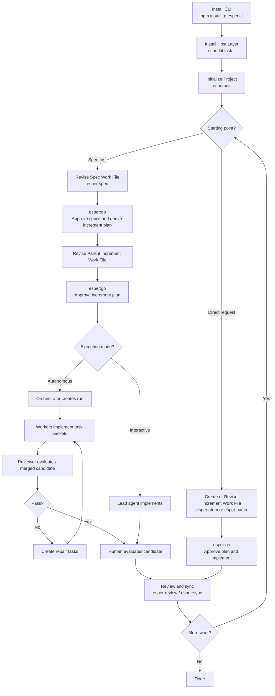

# EsperKit Product Spec

Status: Draft
Date: 2026-03-01

## Summary

EsperKit is a tool-neutral workflow layer for AI-assisted software development. It has two product parts:

1. A CLI toolkit for deterministic project initialization, local project-state management, and filesystem-backed workflow artifacts.
2. A skills and command layer that instructs coding agents how to use those artifacts inside supported hosts.

Together, these two parts provide:

- a durable project constitution
- an agent-facing spec tree
- structured increment and run artifacts
- explicit approval gates
- verifiable delivery rules

EsperKit supports two complementary SDD workflows:

1. Spec-to-Code: the human and a lead agent revise specs first, approve an increment plan, then implement against that spec.
2. Plan-to-Spec: the human starts with a direct request, the agent derives an increment plan, implements it, then syncs the result back into specs.

This spec defines a first-class multi-agent execution model for Spec-to-Code. In that model:

- the human still approves the spec and the parent increment plan
- implementation and repair run as a bounded autonomous loop
- one orchestrator owns shared Esper state
- one or more worker agents implement bounded task packets
- a separate reviewer agent evaluates the merged result
- the human evaluates the final candidate or any escalation

The multi-agent model remains tool-neutral. A concrete role split such as:

- Codex as orchestrator
- Claude Code as implementation worker
- Codex as reviewer

illustrates the model, and EsperKit keeps that arrangement out of its on-disk state model.

## Workflow Usage

This section is the source of truth for expected workflow behavior. Later sections define artifacts, commands, and requirements that align with this behavior.

### 1. Install EsperKit Globally

The user installs the CLI toolkit globally:

```bash
npm install -g esperkit
```

This installs the `esperkit` CLI, which is the local entrypoint for:

- installing host-specific skills and commands
- initializing EsperKit in a project
- managing deterministic local project state

Artifacts:

- created outside the repo: global `esperkit` CLI install
- no repository files are created or changed yet

### 2. Install the Instruction Layer for the Current Host

In the target repository, the user runs:

```bash
esperkit install
```

This installs or updates the host-specific skills and command assets used by coding agents in the current environment.

The CLI scope here is installation and updates. Codebase analysis and spec authoring happen in the instruction layer.

Artifacts:

- created or changed: host-specific instruction assets for the current environment
- no spec files or increment files are authored here

### 3. Initialize EsperKit in the Project

In the repository root, the normal user-facing entrypoint is a skill command. The raw CLI remains the underlying primitive:

- `esper:init`

That instruction-layer workflow:

- ask for workflow preferences
- call `esperkit init` as the deterministic setup primitive
- explain the created scaffolding

The underlying CLI operation is:

```bash
esperkit init
```

This creates deterministic project scaffolding:

- `.esper/`
- `.esper/esper.json`
- `.esper/CONSTITUTION.md`
- `.esper/context.json`
- `.esper/WORKFLOW.md`
- `.esper/increments/pending/`
- `.esper/increments/active/`
- `.esper/increments/done/`
- `.esper/increments/archived/`
- `.esper/runs/`
- the initial spec tree under `spec_root`
- placeholder or template files in the spec tree

At this point, EsperKit is initialized, but the spec tree is still scaffolding rather than a reviewed description of the current system.

Artifacts:

- created: `.esper/`
- created: `.esper/esper.json`
- created: `.esper/context.json`
- created: `.esper/WORKFLOW.md`
- created: `AGENTS.md`
- created: `CLAUDE.md`
- created: `.esper/CONSTITUTION.md`
- created: `.esper/increments/pending/`
- created: `.esper/increments/active/`
- created: `.esper/increments/done/`
- created: `.esper/increments/archived/`
- created: `.esper/runs/`
- created: `<spec_root>/`
- created: `<spec_root>/_work/`
- created: template spec files under `<spec_root>/`
- changed: project config state with workflow preferences

### A. Spec-to-Code Workflow

This is the primary workflow when the spec is the source of truth before implementation.

#### 4. Open the Spec Work File

The user opens the relevant spec work file directly or through a spec-oriented helper workflow.

Examples:

- edit the target spec files directly
- use `esper:spec`

The coding agent must center the review loop on a Markdown work file.

Default rule:

- if the change is confined to one or a few existing spec files, those files are the work files
- if the change spans multiple specs, bootstraps a spec tree from code, or needs staging before landing, the agent creates a temporary coordination file under `<spec_root>/_work/<topic>.md`

The user uses one or more of these channels:

- chat with the agent normally
- edit the Markdown work file directly
- add comments inside the file

The agent must read and resolve comments in the Markdown work file before proceeding.

Artifacts:

- changed: one or more spec files under `<spec_root>/`
- created or changed: `<spec_root>/_work/<topic>.md` when temporary coordination is required
- unchanged: increment files

#### 5. Revise the Specs With the Coding Agent

The user and the lead coding agent continue using that Markdown work file in a review-and-revise loop until the spec tree accurately describes the desired system behavior.

This loop focuses on:

- architecture
- behavior
- interfaces
- data and state flows
- ambiguous or missing requirements

If a temporary coordination file was used, the agent lands approved changes into the durable spec files before implementation starts.

Artifacts:

- changed: the active spec work file
- changed: finalized spec files under `<spec_root>/`
- removed: `<spec_root>/_work/<topic>.md` after its contents are landed

#### 6. Approve the Specs and Derive the Increment Plan

After the specs are approved, the user explicitly signals that the current spec work advances to planning.

Example:

- `esper:go`

When the current work file is a spec work file, the coding agent:

- read the approved spec work file and the finalized spec files it references
- determine the implementation scope implied by those specs
- create one atomic increment or a queue of increments as needed
- create or update the corresponding parent increment Markdown work file
- stop at the plan stage and hand control back to the user for plan review

This plan takes one of two forms:

- a single atomic increment via `esper:atom`
- a queue of increments via `esper:batch`

The resulting increment or queue must be scoped by the relevant spec files and sections.

Artifacts:

- unchanged: approved spec files
- created or changed: `.esper/increments/active/<atomic-id>.md`, or `.esper/increments/active/<batch-id>.md` plus `.esper/increments/pending/<child-id>.md`
- changed: `.esper/context.json` to point at the active increment work

#### 7. Revise the Derived Increment Plan

The user and coding agent review the derived increment work file before implementation starts.

The user:

- edit the increment work file directly
- add comments inside it
- ask the agent to revise the plan in chat

The increment plan must define:

- scope
- verification
- spec references
- expected file impact
- execution mode

Execution mode is:

- `interactive`: one lead agent implements directly after approval
- `autonomous`: the lead agent becomes an orchestrator and runs a bounded multi-agent implementation loop

Artifacts:

- changed: `.esper/increments/active/<id>.md`
- changed: `.esper/increments/pending/<child-id>.md` in batch mode when the queue is revised

#### 8. Approve the Increment Plan and Begin Execution

Once the increment plan is acceptable, the user invokes the same approval command again.

Example:

- `esper:go`

When the current work file is an increment work file, `esper:go` means: approve the plan and begin execution.

If the increment uses `interactive` execution:

- the lead agent implements the planned work directly
- the lead agent validates the result against the approved spec and increment
- the lead agent records progress and verification notes in the active increment

If the increment uses `autonomous` execution:

- the lead agent becomes the orchestrator
- the orchestrator freezes the approved spec snapshot and approved parent increment contract
- the orchestrator creates a machine-readable run record under `.esper/runs/`
- the orchestrator decomposes the work into bounded task packets
- worker agents implement those task packets in isolated branches or worktrees
- the orchestrator integrates completed task outputs into a candidate branch or working tree
- a role-distinct reviewer evaluates the merged candidate
- the orchestrator converts findings into repair tasks and repeats the loop until the run passes or escalates
- the loop continues until the review passes or the run escalates

The parent increment remains the only authoritative human-facing work file throughout both execution modes.

Artifacts:

- changed: source files in the repository
- changed: `.esper/increments/active/<id>.md` with progress, notes, and verification results
- created or changed: `.esper/runs/<run-id>/run.json` in autonomous execution
- created or changed: `.esper/runs/<run-id>/tasks/<task-id>.md` in autonomous execution
- created: commit(s) and PR artifact(s) according to project preferences

#### 9. Autonomous Multi-Agent Execution Mode

Autonomous execution is part of Spec-to-Code. It runs as a bounded implementation mode between human approval of the parent increment and final human evaluation of the candidate.

Rules:

- the approved spec snapshot and approved parent increment file must be frozen before the run starts
- the parent increment in `.esper/increments/active/` remains the sole authoritative human-facing contract
- task packets and run-state files stay subordinate to the parent increment
- only the orchestrator mutates shared `.esper/` control artifacts
- worker agents can use different providers or hosts, and they operate on bounded task packets with explicit scope and acceptance criteria
- worker agents write task outputs only; the orchestrator owns shared `.esper/` control artifacts
- worker agents must implement in isolated branches or worktrees
- the reviewer must be role-distinct from the implementation worker for a given merged change set
- the reviewer can use the same provider as the orchestrator, and it runs as a fresh invocation over persisted artifacts, not a continuation of the orchestrator conversation
- review findings must be converted into explicit repair tasks rather than informal notes
- the run must stop and escalate if it exceeds configured retry, runtime, or cost limits
- the run must stop and escalate if the reviewer finds spec ambiguity, requirement conflict, or a missing approval

Example role split:

- Codex as orchestrator
- Claude Code as implementation worker
- Codex as reviewer in a separate review invocation

Artifacts:

- unchanged: the frozen spec snapshot referenced by the run
- unchanged: the approved parent increment contract, except for progress and final outcome notes
- created or changed: `.esper/runs/<run-id>/run.json`
- created or changed: `.esper/runs/<run-id>/tasks/<task-id>.md`
- created or changed: `.esper/runs/<run-id>/reviews/<review-id>.md`
- created or changed: source files, isolated branches or worktrees, and commits during execution
- changed: `.esper/increments/active/<id>.md` with orchestration notes, review findings, repair rounds, and final disposition

#### 10. Human Evaluation, Review, and Spec Sync

After implementation:

- in `interactive` mode, the user or agent invokes an explicit review pass
- in `autonomous` mode, the user receives the final candidate or an escalation after the automated review loop finishes

Example:

- `esper:review`

`esper:review` means: review the implementation against the approved increment work file and the relevant spec files.

In an autonomous run, the review must examine:

- the frozen spec snapshot
- the approved parent increment
- the merged candidate changes
- validation output
- persisted run findings

After the implementation is accepted, the coding agent syncs the shipped increment back into the relevant spec files so the specs remain authoritative.

Example:

- `esper:sync`

The explicit `esper:sync` command remains available when the user wants to force or retry the post-implementation code-to-spec sync step.

Artifacts:

- changed: relevant spec files under `<spec_root>/`
- changed: `.esper/increments/active/<id>.md` with review and spec-sync notes
- changed: `.esper/context.json` if the increment is advanced or closed
- moved: `.esper/increments/active/<id>.md` to `.esper/increments/done/<id>.md` when the increment is completed
- moved later: `.esper/increments/done/<id>.md` to `.esper/increments/archived/<id>.md` when retention policy requires it

### B. Plan-to-Spec Workflow

This is the workflow where the user starts by telling the coding agent what to do directly.

In this spec, Plan-to-Spec defaults to a single lead agent plus explicit user review. Extending the same run model into Plan-to-Spec is out of scope here.

#### 4. Start From a Direct User Request

The user tells the coding agent what feature, fix, or change they want using the normal work entrypoint.

Examples:

- `esper:atom`
- `esper:batch`

Artifacts:

- created or changed: `.esper/increments/active/<atomic-id>.md`, or `.esper/increments/active/<batch-id>.md` for the parent batch work file
- created or changed: `.esper/increments/pending/<child-id>.md` files for queued batch items
- changed: `.esper/context.json` to point at the active increment work

#### 5. Create and Revise the Increment Work File

Before coding begins, the coding agent must create or open a Markdown increment work file and use it as the collaboration artifact for the review loop.

Default rule:

- in atomic mode, the active increment file is the work file
- in batch mode, the parent increment file is the work file, and child increments are derived from it

The coding agent converts the user request into an implementation plan inside that Markdown work file.

That plan takes one of two forms:

- a single atomic increment
- a queue of increments for a larger batch of work

In batch mode, the coding agent shows a queue preview before execution begins so the user can examine how the requested feature set will be implemented.

The user and coding agent iterate on the work file until the plan is acceptable.

The user:

- review the increment scope
- revise the queue or execution order
- correct misunderstandings before implementation starts
- leave comments directly in the file for the agent to address

Artifacts:

- changed: `.esper/increments/active/<id>.md`
- created or changed: `.esper/increments/pending/<child-id>.md` in batch mode

#### 6. Approve the Increment Plan and Implement

Once the increment plan is acceptable, the user explicitly approves it.

Example:

- `esper:go`

When the current work file is an increment work file, `esper:go` means: approve the current plan and begin implementation.

The coding agent implements the approved plan.

Verification in this workflow first examines the delivered increment against:

- the user’s request
- the approved increment work file

Artifacts:

- changed: source files in the repository
- changed: `.esper/increments/active/<id>.md` with progress, notes, and verification results
- created: commit(s) and PR artifact(s) according to project preferences

#### 7. Review the Implementation Against the Approved Artifact

After implementation, the user or agent invokes an explicit verification pass.

Example:

- `esper:review`

`esper:review` means: review the implementation against the approved increment work file and relevant spec files.

Artifacts:

- changed: `.esper/increments/active/<id>.md` with review findings or sign-off notes
- changed: source files or spec files when the review triggers corrections

#### 8. Sync the Shipped Increment Back Into the Specs

After implementation, the coding agent syncs the shipped increment back into the relevant spec files so the specs remain authoritative.

Example:

- `esper:sync`

Artifacts:

- changed: relevant spec files under `<spec_root>/`
- changed: `.esper/increments/active/<id>.md` with spec-sync notes
- changed: `.esper/context.json` if the increment is advanced or closed
- moved: `.esper/increments/active/<id>.md` to `.esper/increments/done/<id>.md` when the increment is completed

### C. Shared Operational Loop

Across both workflows, the steady-state development loop is:

1. Use `esper:context` if the current state is unclear.
2. Create or revise the current Markdown work file through `esper:spec`, `esper:atom`, or `esper:batch`.
3. Use `esper:go` to approve the current work file and advance to the next stage.
4. Let the active agent workflow proactively update specs, validate changes, and prepare PRs.
5. Use `esper:review` for explicit implementation review.
6. Use `esper:sync` when the shipped implementation needs to be reconciled back into specs.
7. Repeat.

### D. Artifact State Summary

This table summarizes the expected artifact flow across the main workflow stages.

| Stage | Primary command | Active work file | Created | Changed | Removed or closed |
| --- | --- | --- | --- | --- | --- |
| Global install | `npm install -g esperkit` | None | Global `esperkit` CLI install | None in the repo | None |
| Host install | `esperkit install` | None | Host-specific instruction assets | Existing host-specific instruction assets are updated | Replaced generated host assets when needed |
| Project init | `esper:init` -> `esperkit init` | None | `.esper/`, `.esper/context.json`, `.esper/WORKFLOW.md`, `AGENTS.md`, `CLAUDE.md`, `.esper/CONSTITUTION.md`, increment directories, `.esper/runs/`, `<spec_root>/`, `<spec_root>/_work/`, template spec files | Project config state with workflow preferences | Replaced generated scaffolding only when regeneration is explicitly requested |
| Spec authoring | `esper:spec` | Target spec file(s) or `<spec_root>/_work/<topic>.md` | Temporary `_work` file when needed | Active spec work file and relevant spec files | Temporary `_work` file is removed after landing |
| Spec approval to planning | `esper:go` on a spec work file | Approved spec work file | `.esper/increments/active/<atomic-id>.md`, or `.esper/increments/active/<batch-id>.md` plus `.esper/increments/pending/<child-id>.md` | `.esper/context.json` and active increment work file(s) | None |
| Increment plan revision | `esper:atom` / `esper:batch` | `.esper/increments/active/<id>.md` | `.esper/increments/pending/<child-id>.md` in batch mode | Active increment work file and pending child increment files in batch mode | Pending child increments are rewritten when the queue changes |
| Interactive execution | `esper:go` on an interactive increment | `.esper/increments/active/<id>.md` | Commits and PR artifacts when configured | Source files, active increment work file, and relevant spec files when behavior changes | None at this step |
| Autonomous execution | `esper:go` on an autonomous increment | `.esper/increments/active/<id>.md` | `.esper/runs/<run-id>/run.json`, task packets, review records, isolated branches or worktrees, and commits | Source files, active increment work file, run artifacts, and spec files when behavior changes | Superseded or completed task packets as repair rounds advance |
| Human evaluation and review | `esper:review` | `.esper/increments/active/<id>.md` | None | Active increment work file with review findings or sign-off notes | None |
| Post-implementation spec sync | Auto sync or `esper:sync` | `.esper/increments/active/<id>.md` | None | Relevant spec files, active increment work file, and `.esper/context.json` when the increment advances | Active increment moved to `.esper/increments/done/`, and later to `.esper/increments/archived/` when retention policy requires it |

### E. Workflow Flowchart


```mermaid
flowchart TD
    A[Install CLI<br/>npm install -g esperkit] --> B[Install Host Layer<br/>esperkit install]
    B --> C[Initialize Project<br/>esper:init]
    C --> D{Starting point?}

    D -->|Spec-first| E[Revise Spec Work File<br/>esper:spec]
    E --> F[esper:go<br/>Approve specs and derive increment plan]
    F --> G[Revise Parent Increment Work File]
    G --> H[esper:go<br/>Approve increment plan]
    H --> I{Execution mode?}
    I -->|Interactive| J[Lead agent implements]
    I -->|Autonomous| K[Orchestrator creates run]
    K --> L[Workers implement task packets]
    L --> M[Reviewer evaluates merged candidate]
    M --> N{Pass?}
    N -->|No| O[Create repair tasks]
    O --> L
    N -->|Yes| P[Human evaluates candidate]
    J --> P
    P --> Q[Review and sync<br/>esper:review / esper:sync]

    D -->|Direct request| R[Create or Revise Increment Work File<br/>esper:atom or esper:batch]
    R --> S[esper:go<br/>Approve plan and implement]
    S --> Q

    Q --> T{More work?}
    T -->|Yes| D
    T -->|No| U[Done]
```

## Problem

EsperKit already provides a useful filesystem-backed planning model, but it has several gaps:

1. Small tasks can still bypass Esper context entirely.
2. Provider support is mostly installation-level unless workflow semantics are made explicit.
3. The older workflow assumes one coding agent owns planning, implementation, and review.
4. That single-agent assumption becomes a bottleneck when teams want a spec-authoring loop followed by a fully automated implementation loop using multiple agents.
5. Without a first-class run model, multi-agent delegation creates competing sources of truth.
6. Generated project assets can drift from newer workflow semantics if migration is weak.

These gaps make EsperKit less effective as a durable SDD layer across Codex, Claude Code, and similar environments.

## Goals

1. Make EsperKit the source of truth for project intent, system behavior, and workflow state across tools.
2. Keep specs as durable, editable artifacts rather than chat-only output.
3. Support both Spec-to-Code and Plan-to-Spec development.
4. Preserve a single authoritative human-facing work file even when multiple agents are involved.
5. Support bounded multi-agent execution for Spec-to-Code after explicit human approval.
6. Keep the system provider-neutral and resilient to host capability differences.
7. Keep project artifacts versioned and migratable so upgrades do not silently drift.
8. Keep the default workflow AI-native: proactive validation, proactive spec maintenance, and minimal command friction.

## Non-Goals

1. EsperKit scope excludes hosted orchestration platforms.
2. EsperKit scope excludes project management suites with assignments, estimates, or dashboards.
3. EsperKit integrates with existing CI/CD, issue trackers, and source control instead of absorbing those systems.
4. EsperKit keeps small edits lightweight.
5. EsperKit uses filesystem-backed local orchestration rather than a distributed scheduler or long-running background service.
6. EsperKit starts with a portable core workflow and expands host integrations over time.

## Design Principles

1. Tool-neutral first: project state must remain readable without depending on one vendor runtime.
2. Specs are durable: the spec tree must live in files, be revisable, and stay aligned with shipped behavior.
3. One contract at a time: one parent increment remains authoritative even when many agents contribute.
4. Frozen inputs for autonomy: autonomous runs must review against persisted, approved artifacts rather than conversational memory.
5. Role separation: implementation and review are distinct roles for a merged change set.
6. Bounded autonomy: automated loops must have explicit stop conditions and escalation rules.
7. Progressive structure: small work stays light; large work gets more rigor.
8. Migrate, do not drift: generated assets must be versioned and upgradable.
9. Fail loudly when enforcing rules: blocking validation must actually block.

## Users

### Primary Users

- solo developers using AI coding agents daily
- small product teams using agent-driven development
- developers working across coding-agent terminals and IDE-like tools

### Secondary Users

- tool builders integrating EsperKit state into custom agent workflows
- contributors joining a project mid-stream who need durable context
- teams adopting spec-first work for larger, higher-risk changes

## Product Structure

EsperKit is a two-part product.

### 1. CLI Toolkit

The CLI toolkit is the executable layer. It is responsible for:

- installation
- deterministic project initialization
- creating and mutating local Esper artifacts
- publishing machine-readable project state
- supporting direct invocation by coding agents via shell commands

The CLI is the source of truth for persisted project state and filesystem transitions.
Its responsibility is deterministic state transitions. Semantic authoring of specs, increments, run findings, and other judgment-heavy content lives in the instruction layer.

### 2. Skills and Commands

The skills and command layer is the instruction layer. It is responsible for:

- telling coding agents how to operate on top of the CLI toolkit
- guiding spec, planning, review, and execution loops
- adapting EsperKit workflow semantics to specific hosts
- orchestrating multi-agent execution while preserving the shared on-disk contract

This layer orchestrates behavior. The CLI owns durable state transitions and persisted project state.

### Relationship Between the Two Parts

- The CLI toolkit must remain usable on its own.
- Skills and commands are operational wrappers on top of the CLI and project artifacts.
- Hosts without skills or commands use the CLI toolkit directly.
- Skills can be provider-specific, but the CLI toolkit and on-disk model remain tool-neutral.

## Core Concepts

### Constitution

A durable project-level document describing project identity, scope boundaries, key technical decisions, testing strategy, and core development principles.

### Spec

The durable agent-facing documentation tree that describes how the system works: intended design, current behavior, architecture, interfaces, and enduring requirements.

### Increment

The primary human-facing work artifact in EsperKit. An increment stores what will change, why it matters, how it will be verified, what spec it touches, and how the work is expected to execute.

### Parent Increment

The active increment file in `.esper/increments/active/` that remains the authoritative human-facing contract for the current approved work. In batch mode, this is a parent wrapper. In autonomous execution, it remains authoritative while subordinate run artifacts change underneath it.

### Run

A machine-readable autonomous execution record derived from an approved parent increment. A run stores frozen inputs, delegated roles, child task packets, review rounds, status, and stop conditions for a bounded implementation-review-repair loop.

### Task Packet

A bounded machine-managed work item inside a run. A task packet is a run artifact, separate from user-facing increments, and it constrains one worker execution attempt with explicit scope, dependencies, and acceptance criteria.

### Review Record

A persisted record of a review pass inside an autonomous run. It stores the reviewed candidate, the frozen inputs used for evaluation, findings, and any resulting repair requirements.

### Working File

The Markdown file that the user and coding agent use as the active review-and-revise artifact for a workflow step. Users communicate through chat, direct file edits, or file comments. The agent treats unresolved file comments as active feedback.

Default working-file rules:

- in Spec-to-Code, the working file is the target spec file or a temporary coordination file under `<spec_root>/_work/`, then the parent increment
- in atomic Plan-to-Spec, the active increment file is the working file
- in batch Plan-to-Spec, the parent increment file is the working file

### Runtime Context

A machine-readable summary of the current Esper state so any tool can load the right project context before taking action.

## Workflow Model

The authoritative workflow behavior is defined in `Workflow Usage`.

EsperKit must support:

- a spec-to-code flow built from `esper:spec`, `esper:go`, implementation, review, and `esper:sync`
- a plan-to-spec entry path through `esper:atom` and `esper:batch`
- review-and-revise loops centered on Markdown work files
- atomic and systematic increments without losing context between them
- a bounded autonomous execution mode inside Spec-to-Code

The core approval boundary is:

1. The human approves the spec.
2. The human approves the parent increment plan.
3. The system executes within the approved contract.
4. The human evaluates the delivered candidate or escalation.

There must never be multiple competing top-level authoritative work files for one active unit of work.

## Functional Requirements

### A. CLI Foundation

#### 1. Initialization

The underlying initialization primitive is `esperkit init`. The normal user-facing initialization flow uses an EsperKit skill command.

`esperkit init` must bootstrap the project deterministically.

It must:

- create the `.esper/` project state directory
- create `.esper/esper.json`
- set `spec_root` if missing, defaulting to `specs`
- create the initial spec-tree directories under `spec_root`
- create `<spec_root>/_work/`
- create deterministic placeholder or template spec files
- create `.esper/context.json`
- create `.esper/WORKFLOW.md`
- create `.esper/increments/` storage
- create `.esper/runs/`
- persist user workflow preferences captured by the instruction layer

Constraints:

- `esperkit init` must only create deterministic scaffolding and state
- it performs deterministic scaffolding and state transitions only
- it is non-destructive when `spec_root` already exists
- it avoids overwriting existing files unless the user explicitly requests regeneration

The instruction-layer initialization flow collects preferences such as:

- commit behavior
- PR behavior
- validation behavior
- spec-sync behavior
- default work mode
- review behavior
- retention behavior
- default agent-role mapping
- autonomous run policy

#### 2. Instruction-Layer Installation

The CLI toolkit must install and update the skills and command layer for supported hosts.

It must:

- install or update host-specific instruction assets
- keep the underlying project model consistent across hosts
- remain the delivery mechanism for the instruction layer

#### 3. Runtime Contract

The CLI toolkit must publish project state in a host-agnostic way.

Required artifact:

- `.esper/context.json`

This runtime index must include:

- path to the constitution
- spec root path
- active increment, if any
- active increment scope, if any
- active run, if any
- active execution mode for the current increment
- default commands for test, lint, typecheck, and dev
- expected workflow mode
- artifact schema version

Requirements:

- the CLI must write and maintain it deterministically
- any host must be able to read it without parsing multiple Markdown files
- it complements source Markdown artifacts instead of replacing them
- it must be sufficient to resume interrupted work without reconstructing state from chat history

The CLI must also write a human-readable bootstrap document such as:

- `AGENTS.md`
- `CLAUDE.md`
- `.esper/WORKFLOW.md`

That document must tell an external tool:

1. What files to read before making changes
2. Whether an increment is active
3. Which spec is authoritative for current work
4. What verification commands are expected

### B. Spec System

#### 4. Spec Tree

The spec tree is the durable agent-facing documentation system for how the product works.

Rules:

- the default spec root is `/specs`
- `spec_root` must be configurable per project
- `spec_root` must be repository-relative
- all spec commands and references must use `spec_root`
- the spec root is a documentation tree, not a single-file location

Default example layout:

```text
specs/
  index.md
  _work/
  system/
    architecture.md
    data-model.md
  product/
    behavior.md
    user-flows.md
  interfaces/
    cli.md
    api.md
```

The spec tree exposes one entrypoint file:

- `<spec_root>/index.md`

#### 5. Spec Coverage and Operations

Across the spec tree, the system must support coverage for:

1. Summary
2. Problem
3. Goals
4. Non-Goals
5. User flows
6. Functional requirements
7. Non-functional requirements
8. Data model or state model
9. Interfaces and integration points
10. Rollout and migration
11. Open questions

The spec tree distributes these sections across multiple files as needed.

The CLI must support deterministic spec-tree operations:

- create the spec tree if missing
- create the `_work/` subdirectory
- create empty or template-based spec files
- read the spec index and referenced files
- inspect spec metadata
- link increments to one or more spec files or sections

The spec tree uses a simple lifecycle:

- draft
- active
- archived

Semantic authoring and revision of spec contents must be performed by coding agents using EsperKit skills or commands, not by the CLI alone.

#### 6. Spec Authoring From Existing Code

When initializing an existing codebase, code-to-spec generation must be performed by coding agents using EsperKit skills or commands, not by the CLI alone.

Those agent workflows author a first-pass spec tree that summarizes:

- current architecture and module boundaries
- important data models and state flows
- external interfaces
- observable system behavior and user-facing flows, where inferable
- important unknowns, ambiguities, or inferred assumptions

Specs authored from code analysis must be clearly labeled as inferred and requiring human review.

### C. Increment and Run System

#### 7. Spec-Guided Increment Authoring

Users must be able to create work artifacts with the spec tree as reference context.

Requirements:

- users author one or more increments against the spec tree
- users group increments into larger delivery waves when needed
- increment artifacts record which spec files or sections they reference
- increments are traceable to specific requirements
- the parent increment must be a Markdown file that serves directly as the user-agent review artifact

Increments support these fields by default:

- `spec`
- `spec_version` or `spec_snapshot`
- `spec_section`
- `requirements`
- `execution_mode`

#### 8. Spec Maintenance During Delivery

The system must support keeping the spec tree current as work ships.

Requirements:

- increments declare whether they modify product behavior, architecture, or public interfaces
- if they do, the agent workflow updates relevant spec files before an increment is considered complete
- the completion flow links the implementation artifact to the updated spec section
- users do not need to manually remember to trigger spec maintenance in the normal path
- the agent workflow runs relevant tests and validation before treating an increment as complete
- when project preferences indicate it, the agent workflow prepares or creates a PR as part of increment completion

The system detects and surfaces common drift signals:

- work marked complete with no linked spec update
- spec references pointing to missing files
- public interface changes with no matching spec touch

#### 9. Increment Model

`increment` is the primary persisted human-facing work artifact.

Requirements:

- increments must be lightweight enough for atomic work
- increments must be structured enough for systematic work
- increments must inherit constitution, spec, and runtime context
- increments must support grouping and sequencing
- increments must support completion state and optional spec-maintenance requirements

The system must support two primary work modes:

- single-job mode: one atomic or bounded increment at a time
- queued mode: a series of increments processed sequentially with minimal pauses

Increment storage:

- `.esper/increments/active/` for the current active parent increment
- `.esper/increments/pending/` for user-visible queued child increments that are not yet active
- `.esper/increments/done/` for completed increments after sync and close-out
- `.esper/increments/archived/` for retained historical increments

Default lifecycle:

1. Create the active atomic or parent batch work file in `.esper/increments/active/`.
2. In batch mode, place not-yet-active child increments in `.esper/increments/pending/`.
3. Keep the current parent increment in `.esper/increments/active/` through planning, execution, review, and sync.
4. Move the increment to `.esper/increments/done/` when the sync step closes it.
5. Optionally move older completed increments from `.esper/increments/done/` to `.esper/increments/archived/`.

Minimum increment shape:

1. Title
2. Context
3. Scope
4. Type
5. Size or lane (`atomic` or `systematic`)
6. Files affected
7. Verification
8. Spec impact
9. Progress

Recommended metadata:

- `id`
- `title`
- `status`
- `type`
- `lane`
- `execution_mode`
- `run_id`
- `parent`
- `depends_on`
- `priority`
- `created`
- `spec`
- `spec_section`

#### 10. Autonomous Run Model

The system must support a bounded autonomous execution mode for an approved parent increment in Spec-to-Code.

Requirements:

- autonomous execution must start only after the user approves the parent increment through the normal workflow
- the approved parent increment remains the sole authoritative human-facing contract for the run
- the system must create a machine-readable run artifact for each autonomous execution
- task packets are modeled as run artifacts, not concurrent active increments
- the system must support decomposing the approved parent increment into child task packets linked back to the parent increment and relevant spec sections
- task packets must record, at minimum: `id`, `parent`, `depends_on`, `spec`, `spec_section`, `base_commit`, `files_allowed`, `verification`, `acceptance_criteria`, `assigned_role`, and `status`
- the system must freeze the spec and increment inputs used for review
- the autonomous loop preserves the approved requirements throughout the run
- the orchestrator must be the only role allowed to mutate shared `.esper/` control state
- implementation workers run under different providers or hosts when configured, and they work in isolated branches or worktrees
- the reviewer must be role-distinct from the implementation worker for a given merged change set
- the reviewer can share the same provider as the orchestrator, and it runs as a fresh invocation over persisted artifacts
- review findings must be persisted as structured repair work that can be dispatched back to implementation workers
- the run must support explicit stop states such as `passed`, `failed`, `blocked`, `escalated`, and `cancelled`
- autonomous execution must stop and escalate when it hits configured retry, runtime, or cost budgets, or when requirements are ambiguous

Run storage:

- `.esper/runs/<run-id>/run.json`
- `.esper/runs/<run-id>/tasks/`
- `.esper/runs/<run-id>/reviews/`

### D. Interoperability and Operations

#### 11. External Tool Interoperability

EsperKit must work across coding agents and IDE-like tools.

Supported host categories:

- Claude Code
- Codex
- Superset and similar IDE-like tools
- generic tool environments that can read files and run shell commands

The system must model host capabilities such as:

- structured prompts
- plan mode
- todo or checklist APIs
- subagent or task delegation
- cross-provider task delegation
- role-separated orchestration and review
- hook integration

Fallback rules:

- structured prompts fall back to concise plain-text prompts
- plan mode falls back to inline checklist generation
- todo APIs fall back to Markdown checklists
- subagent exploration falls back to local repository search
- multi-agent execution falls back to one agent performing orchestrator, worker, and reviewer roles sequentially using the same persisted run artifacts
- host-specific hooks fall back to durable file-based reminders

Provider-specific assets vary by host, and:

- workflow semantics must stay consistent
- project state must stay tool-neutral
- provider-specific behavior is explicit and named in config
- agent roles map to different providers or hosts as long as the on-disk run contract stays consistent

#### 12. Configuration

Configuration must support the spec, increment, and run model.

The durable configuration artifact is:

- `.esper/esper.json`

`.esper/esper.json` is the source of truth for project configuration.
`.esper/context.json` is a derived runtime index built from configuration plus active work state.

Configuration categories:

- system metadata
- path configuration
- command configuration
- workflow defaults
- delivery policies
- agent role mapping
- agent launch configuration
- autonomous run policy

Required top-level fields:

- `schema_version`
- `backlog_mode`
- `spec_root`
- `commands`
- `workflow_defaults`

Supported top-level fields:

- `schema_version`
- `backlog_mode`
- `spec_root`
- `commands`
- `workflow_defaults`
- `spec_policy`
- `increment_policy`
- `agent_roles`
- `autonomous_run_policy`
- `provider_defaults`

Field semantics:

- `schema_version`: the version of the persisted Esper configuration schema
- `backlog_mode`: how increments are stored and surfaced; the default value is `local`
- `spec_root`: the repository-relative path to the spec tree
- `commands`: the canonical project commands the agent runs for validation and development tasks
- `workflow_defaults`: project-wide workflow guidance stored as prompt-like policy text
- `spec_policy`: spec governance guidance stored as prompt-like policy text
- `increment_policy`: increment shaping guidance plus bounded guardrails
- `agent_roles`: the provider and host mapping for named execution roles, including role-specific launch overrides
- `autonomous_run_policy`: the global limits and guardrails for autonomous execution
- `provider_defaults`: provider-specific operating guidance plus provider-level launch defaults

Configuration value types:

- closed controls use enums, booleans, numbers, and identifiers when the CLI or runtime branches on a fixed set of values
- policy controls use prompt-like instruction strings when agent behavior depends on project-specific judgment
- prompt-like configuration uses stable keys with natural-language values
- EsperKit stores prompt-like values verbatim and preserves user wording
- the CLI validates key presence and value type, and it preserves prompt-like fields as written

The `commands` object uses these keys:

- `test`
- `lint`
- `typecheck`
- `dev`

Each command value is a shell command string. Empty strings disable that command slot for the project.

`workflow_defaults` stores prompt-like policy text in stable slots:

- `planning`
- `commits`
- `pull_requests`
- `validation`
- `spec_sync`
- `review`
- `retention`

Each `workflow_defaults` value is an agent-facing instruction string.

`workflow_defaults` field semantics:

- `planning`: the default planning guidance, including when to prefer `atom` versus `batch`
- `commits`: the default commit behavior and commit granularity guidance
- `pull_requests`: the default PR creation and PR grouping guidance
- `validation`: the default validation and enforcement guidance
- `spec_sync`: the default code-to-spec synchronization guidance
- `review`: the default review timing and review rigor guidance
- `retention`: the default increment close-out and archival guidance

Runtime use of `workflow_defaults`:

- skills read these prompt slots as policy instructions before planning or execution
- the active increment may quote or override the relevant prompt slot for the current unit of work
- the active run may derive narrower task instructions from these prompt slots
- explicit increment fields and run fields win over generic workflow prompts for the current scope

`spec_policy` stores prompt-like policy text in stable slots:

- `maintenance`
- `approval`
- `drift`

`spec_policy` field semantics:

- `maintenance`: how and when spec maintenance is required during delivery
- `approval`: the approval conditions for spec-driven work before implementation starts
- `drift`: how the workflow treats missing spec updates, missing links, or stale spec references

`increment_policy` stores:

- `sizing`
- `batching`
- `execution`
- `max_files_per_atomic_increment`

`increment_policy` field semantics:

- `sizing`: how the planner sizes atomic increments and when it splits work
- `batching`: when the planner groups work into a batch instead of a single increment
- `execution`: when the planner uses interactive execution versus autonomous execution
- `max_files_per_atomic_increment`: the file-count limit the planner uses before splitting work

`agent_roles` stores mappings for:

- `orchestrator`
- `implementer`
- `reviewer`

Each role mapping stores:

- `provider`
- `host`
- `fresh_invocation`
- `launch`

`agent_roles.<role>.launch` stores exact agent-spawn settings for that role.

The `launch` object stores:

- `command`
- `args`
- `env`
- `workdir_strategy`
- `permission_profile`

`launch` field semantics:

- `command`: the executable the orchestrator uses to open that agent
- `args`: the baseline argument list for that agent process
- `env`: environment variables applied at process launch
- `workdir_strategy`: where the spawned agent starts; common values include `repo-root`, `task-worktree`, and `run-worktree`
- `permission_profile`: the semantic permission posture for that launch; provider adapters translate this into concrete flags or environment changes

Role semantics:

- `orchestrator`: the agent responsible for creating runs, task packets, and final run state
- `implementer`: the default worker role for delegated implementation tasks
- `reviewer`: the role that evaluates merged candidates and emits structured findings

`autonomous_run_policy` stores:

- `enabled`
- `max_review_rounds`
- `max_runtime_minutes`
- `max_cost`
- `require_distinct_reviewer`
- `allow_parallel_tasks`

`autonomous_run_policy` field semantics:

- `enabled`: whether autonomous execution is available in the project
- `max_review_rounds`: the maximum number of review-repair loops per run
- `max_runtime_minutes`: the wall-clock cap for a run
- `max_cost`: the project-defined cost ceiling for a run
- `require_distinct_reviewer`: whether the reviewer role must remain separate from the implementation role for a merged candidate
- `allow_parallel_tasks`: whether the orchestrator may dispatch independent tasks concurrently

`provider_defaults` stores provider-specific prompt-like policy text and provider-level launch defaults keyed by provider name.

Each provider entry uses stable slots such as:

- `orchestration`
- `implementation`
- `review`
- `launch_defaults`

`launch_defaults` stores the provider's default launch object shape:

- `command`
- `args`
- `env`
- `workdir_strategy`
- `permission_profile`

Provider policy slots store provider-specific operating guidance that refines behavior for that provider without changing the shared workflow contract.

Launch resolution for spawned agents:

1. provider launch defaults from `provider_defaults.<provider>.launch_defaults`
2. role-specific launch overrides from `agent_roles.<role>.launch`
3. task-local overrides from the active run or task packet when the run requires a narrower launch context

Later layers override earlier layers for the spawned process.

Configuration resolution order:

1. built-in Esper defaults
2. `.esper/esper.json`
3. active parent increment overrides
4. active run overrides
5. explicit CLI flags for the current invocation

Later layers override earlier layers for that invocation only. The CLI writes durable changes only to `.esper/esper.json`, increment artifacts, or run artifacts.

Normalization rules:

- `spec_root` is repository-relative and stored without a leading slash
- path values use forward slashes
- enum values use lowercase kebab-case
- absent optional sections are omitted from disk and resolved from defaults at runtime
- persisted JSON uses stable key ordering

Mutation rules:

- `esperkit init` writes the initial `.esper/esper.json`
- `esperkit config set` mutates `.esper/esper.json`
- `esperkit migrate` upgrades `.esper/esper.json` when the schema changes
- skills and slash commands use CLI mutations for durable config changes
- invalid config writes fail loudly and leave the existing file unchanged
- config mutations refresh `.esper/context.json` so runtime state stays in sync

Example configuration shape:

```json
{
  "schema_version": 1,
  "backlog_mode": "local",
  "spec_root": "specs",
  "commands": {
    "test": "npm test",
    "lint": "npm run lint",
    "typecheck": "npm run typecheck",
    "dev": "npm run dev"
  },
  "workflow_defaults": {
    "planning": "Default to atom. Switch to batch when the approved work spans multiple feature slices, spec areas, or merge-conflict-prone tasks.",
    "commits": "Create one commit per validated increment. Leave partial work uncommitted unless the user explicitly asks for checkpoint commits.",
    "pull_requests": "Open one PR per completed increment. Group related atomic follow-ups into the same PR only when they ship together.",
    "validation": "Run the configured test and typecheck commands before marking work complete. Treat configured checks as blocking unless the active increment says otherwise.",
    "spec_sync": "Sync specs proactively after implementation and before close-out whenever behavior, architecture, or interfaces change.",
    "review": "Run esper:review before esper:sync. In autonomous runs, require a reviewer pass before returning the candidate to the human.",
    "retention": "Keep completed increments in done until the next explicit archive step or release cleanup."
  },
  "spec_policy": {
    "maintenance": "Require spec updates before close-out whenever behavior, architecture, or public interfaces change.",
    "approval": "Start implementation only after the referenced spec sections are approved and free of unresolved comments.",
    "drift": "Treat missing spec links, missing spec updates, and stale references as review failures."
  },
  "increment_policy": {
    "sizing": "Keep atomic increments small enough for one review pass and one coherent commit.",
    "batching": "Use batch mode when the approved work spans multiple feature slices, staged merges, or independently reviewable steps.",
    "execution": "Use interactive execution by default. Use autonomous execution only when the parent increment defines task boundaries and review guardrails clearly.",
    "max_files_per_atomic_increment": 8
  },
  "agent_roles": {
    "orchestrator": {
      "provider": "codex",
      "host": "codex",
      "fresh_invocation": true,
      "launch": {
        "workdir_strategy": "repo-root",
        "permission_profile": "default"
      }
    },
    "implementer": {
      "provider": "claude-code",
      "host": "claude-code",
      "fresh_invocation": true,
      "launch": {
        "args": [
          "code",
          "--dangerously-skip-permissions"
        ],
        "workdir_strategy": "task-worktree",
        "permission_profile": "bypass"
      }
    },
    "reviewer": {
      "provider": "codex",
      "host": "codex",
      "fresh_invocation": true,
      "launch": {
        "workdir_strategy": "task-worktree",
        "permission_profile": "read-heavy"
      }
    }
  },
  "provider_defaults": {
    "codex": {
      "orchestration": "Use Codex for parent planning, run creation, and final run-state updates.",
      "review": "Use a fresh Codex invocation for review so findings come from persisted artifacts instead of orchestration context.",
      "launch_defaults": {
        "command": "codex",
        "args": [],
        "env": {},
        "workdir_strategy": "repo-root",
        "permission_profile": "default"
      }
    },
    "claude-code": {
      "implementation": "Use Claude Code for bounded implementation tasks in isolated worktrees and return task-scoped results only.",
      "launch_defaults": {
        "command": "claude",
        "args": [
          "code"
        ],
        "env": {},
        "workdir_strategy": "task-worktree",
        "permission_profile": "default"
      }
    }
  },
  "autonomous_run_policy": {
    "enabled": true,
    "max_review_rounds": 3,
    "max_runtime_minutes": 60,
    "max_cost": null,
    "require_distinct_reviewer": true,
    "allow_parallel_tasks": true
  }
}
```

#### 13. Project Asset Migration

Generated assets must be versioned and upgradable.

Requirements:

- track a project-level `schema_version`
- detect outdated generated assets
- provide migration commands that update generated files without destroying user-authored content
- show a clear diff or change summary before destructive replacements

Migration scope must include:

- runtime context files
- bootstrap documents
- config schema changes
- run artifact schema changes
- future provider-specific project assets

#### 14. Verification and Enforcement

The system must clearly separate advisory checks from blocking checks.

Rules:

- if a check is described as blocking, it must exit non-zero on failure
- if a check is advisory, that must be explicitly labeled
- completion and shipping flows must respect the configured verification policy
- autonomous runs must persist which checks were run, in what mode, and on which candidate

Quick verification runs after edits when configured, and its enforcement mode is explicit:

- advisory
- blocking

## Upgrade Path

EsperKit must provide a clear upgrade path for existing projects.

Requirements:

- new fields in specs, increments, and runs must be optional when reading older artifacts
- projects without `spec_root` default to `specs`
- projects without increment storage must be initialized or explicitly migrated before using the new workflow
- projects without run storage must be explicitly migrated before using autonomous execution
- migration is opt-in where changes affect user workflows
- the new workflow retires runtime support for legacy phase or task storage

## Proposed Filesystem Layout

```text
.esper/
  esper.json
  context.json
  CONSTITUTION.md
  WORKFLOW.md
  increments/
    pending/
    active/
    done/
    archived/
  runs/
    <run-id>/
      run.json
      tasks/
      reviews/
  hooks/

specs/
  index.md
  _work/
  system/
  product/
  interfaces/
```

The `specs/` tree above is only the default. The actual root must come from `spec_root`.

## Proposed CLI Toolkit Surface

EsperKit exposes a CLI surface equivalent to:

- `esperkit install`
- `esperkit init`
- `esperkit config get [key]`
- `esperkit config set <key> <value>`
- `esperkit context get`
- `esperkit spec index`
- `esperkit spec get <file>`
- `esperkit spec create <path>`
- `esperkit spec set-root <path>`
- `esperkit spec archive <file>`
- `esperkit increment list`
- `esperkit increment get <file>`
- `esperkit increment create`
- `esperkit increment activate <file>`
- `esperkit increment finish <file>`
- `esperkit increment set <field>`
- `esperkit increment group`
- `esperkit run create <increment>`
- `esperkit run get <id>`
- `esperkit run list`
- `esperkit run stop <id>`
- `esperkit doctor`
- `esperkit migrate`

CLI creation commands are deterministic scaffolding or state-transition commands, not semantic authoring commands.

## Proposed Skill and Slash-Command Surface

EsperKit must also ship an instruction surface for coding agents.

### Naming Model

The user-facing command surface is small, explicit, and easy to type.

Design rules:

- commands are short and ergonomic
- the primary user-facing surface uses a small number of high-leverage commands
- specialized sub-workflows exist as secondary paths, not default entrypoints

Recommended pattern:

- use the `esper:*` naming model consistently across hosts
- keep the command set small and predictable

Examples:

- `esper:init`, `esper:spec`, `esper:atom`, `esper:batch`
- `esper:go`, `esper:review`, `esper:sync`, `esper:continue`, `esper:context`

### Core Workflows

#### 1. `esper:init`

Purpose:

- initialize EsperKit in the current repository
- guide the user through first-time setup
- hand off deterministic setup to the CLI toolkit

Expected behavior:

- confirm repository context
- run `esperkit init`
- ask for workflow preferences before or during initialization
- explain what scaffolding was created
- direct the user to the next step: spec bootstrapping

#### 2. `esper:spec`

Purpose:

- be the main command for creating, reviewing, and revising spec work files

Expected behavior:

- read `.esper/context.json`, `.esper/WORKFLOW.md`, and the current spec tree
- open relevant spec files as the working files when possible
- create `<spec_root>/_work/<topic>.md` when temporary coordination is needed
- revise spec content based on user edits, comments, and chat feedback
- stop in the spec review loop until the user is satisfied or explicitly advances with `esper:go`

#### 3. `esper:go`

Purpose:

- approve the current Markdown work file and advance to the next workflow stage

This is the shared approval command for both Spec-to-Code and Plan-to-Spec workflows.

Expected behavior:

- read `.esper/context.json`
- inspect the current active Markdown work file
- determine whether the active work file is:
  - a spec work file
  - an increment work file
- if the active work file is a spec work file:
  - derive an implementation plan from approved specs
  - choose atomic or batch mode
  - create or update the corresponding parent increment Markdown work file
  - stop at the plan-review stage
- if the active work file is an increment work file:
  - treat the plan as approved
  - begin execution
  - if `execution_mode` is `autonomous`:
    - freeze the approved spec and increment inputs
    - create or update the corresponding run artifact
    - continue through delegated implementation, review, and repair rounds until the run passes or escalates
  - otherwise:
    - continue with direct implementation, validation, spec maintenance, and PR preparation

#### 4. `esper:context`

Purpose:

- summarize the current runtime state for the user and the agent

Expected behavior:

- read `.esper/context.json`
- summarize active increment, active run if any, spec root, and expected commands
- identify the immediate next safe action

#### 5. `esper:atom`

Purpose:

- be the main entrypoint for atomic Plan-to-Spec work

Expected behavior:

- read `.esper/context.json`, the active increment if present, and relevant spec files
- use the active increment file as the primary Markdown working file
- create or open the atomic increment Markdown working file
- determine which stage the user is in
- keep the workflow in plan-authoring mode until the user explicitly advances with `esper:go`

#### 6. `esper:batch`

Purpose:

- be the main entrypoint for queued or series work

Expected behavior:

- gather or confirm the intended feature set
- inspect any existing increment queue
- decompose the requested feature set into a queue when needed
- create or open the parent batch work file before execution
- present a queue preview before execution
- if the parent increment will use autonomous execution, define role assignments and stop conditions before execution
- keep the workflow in plan-authoring mode until the user explicitly advances with `esper:go`

The queue preview shows, at minimum:

- the increments the agent intends to execute
- the planned execution order
- the high-level scope of each increment
- the relevant spec files or sections expected to change
- the expected validation approach
- the planned agent roles for orchestration, implementation, and review when autonomous execution is enabled
- the autonomous stop conditions when autonomous execution is enabled

#### 7. `esper:review`

Purpose:

- perform a focused verification pass over implemented changes

Expected behavior:

- read the current implementation state
- compare current changes against the approved increment work file and relevant specs
- identify drift, regressions, missing spec maintenance, or scope creep
- write review findings or sign-off notes back into the active increment work file
- when an autonomous run is active or recently completed, review against the frozen run inputs and persisted run findings
- recommend precise follow-up actions

#### 8. `esper:sync`

Purpose:

- run an explicit code-to-spec sync pass after implementation

Expected behavior:

- read `.esper/context.json`
- inspect the shipped implementation and the active increment work file
- update the relevant spec files so they match shipped system behavior
- record spec-sync notes in the increment work file
- stop when the code-to-spec sync is complete

#### 9. `esper:continue`

Purpose:

- resume work from current project state without re-establishing context manually

Expected behavior:

- read `.esper/context.json`
- identify the active increment, active run if any, and relevant spec files
- summarize remaining work and resume at the correct point

### Optional Specialized Workflows

Hosts can expose more specific expert commands. These remain secondary and optional.

Examples:

- `esper:spec-bootstrap`
- `esper:spec-revise`
- `esper:spec-review`
- `esper:increment-new`
- `esper:increment-finish`
- `esper:run-inspect`

### Lifecycle Coverage

The command set above must fully cover the workflow defined earlier in `Workflow Usage`.

In practice, that means the instruction layer must support:

- initialization through `esper:init`
- spec authoring through `esper:spec`
- approval and stage advancement through `esper:go`
- direct-request work through `esper:atom` and `esper:batch`
- explicit review through `esper:review`
- post-implementation spec sync through `esper:sync`
- context recovery through `esper:context` and `esper:continue`

### Requirements

- skills and commands translate user intent into CLI-backed state transitions
- commands are short and easy to input during active development
- the primary command surface stays small
- they read project artifacts instead of relying on conversational memory
- they vary by host syntax, and their workflow semantics remain consistent across providers
- they do not define state formats that diverge from the CLI toolkit
- they own codebase-analysis workflows that produce or revise specs from existing code
- they own semantic authoring workflows for specs, increments, task packets, and review findings while using the CLI only for deterministic state operations
- smart commands infer the current workflow stage from project state before asking the user to choose a narrow sub-step
- smart commands proactively perform the next responsible actions, including validation, spec maintenance, and PR preparation when configured

## Success Criteria

1. A user can initialize EsperKit in a repository through `esper:init`, with the CLI handling deterministic setup underneath.
2. A coding agent using EsperKit skills can analyze the current codebase and draft the initial spec tree.
3. A user can use `esper:spec` to create and revise spec work files before implementation.
4. A user can use `esper:go` to approve the current work file and advance to the next stage.
5. A user can review and approve one parent increment before implementation starts.
6. In Spec-to-Code, a user can choose between interactive execution and autonomous execution for the parent increment.
7. In autonomous Spec-to-Code execution, the parent increment remains the only authoritative human-facing work file.
8. EsperKit can support role splits such as Codex as orchestrator, Claude Code as implementation worker, and Codex as reviewer, without introducing multiple competing control artifacts.
9. An autonomous run can decompose work into task packets, integrate changes, record review findings, and loop on repairs before returning control to the human.
10. A user can perform final human evaluation after the automated loop rather than supervising every repair round.
11. In Plan-to-Spec, a user can start from a direct request, review the coding agent’s plan, then have the coding agent sync the shipped change back into specs.
12. Every review-and-revise loop is centered on a Markdown working file that the user can inspect and edit directly.
13. An external tool can read one machine-readable runtime file and one human-readable workflow file to understand the current project state.
14. The spec directory is configurable and defaults to `/specs`.
15. Existing projects can be explicitly upgraded into the new model with a clear one-way path.
16. Blocking verification behavior is genuinely blocking.

## Rollout Plan

### Phase 1: Interoperability Foundation

- clarify the CLI toolkit vs skill-layer boundary
- add `esperkit install`
- add `esperkit init`
- add `.esper/context.json`
- add `.esper/WORKFLOW.md` plus bootstrap docs
- add migration support for generated assets

### Phase 2: Spec Foundation

- add the spec artifact model
- add spec CLI support
- add default spec-tree templates and index
- add skill-driven code-to-spec generation workflows
- add the primary spec authoring workflow (`esper:spec`)
- add shared approval-and-advance semantics (`esper:go`)

### Phase 3: Increment Foundation

- add unified increment artifacts
- add increment CLI support
- add single-job smart work (`esper:atom`)
- add queued work (`esper:batch`)
- add proactive validation, spec maintenance, and PR preparation

### Phase 4: Autonomous Run Foundation

- add run artifacts under `.esper/runs/`
- add run metadata in increments and runtime context
- add bounded orchestration rules for task delegation, review, and repair loops
- add role-mapping defaults for mixed-provider execution
- add recovery and resume behavior for interrupted runs

### Phase 5: Spec Synchronization and Drift Detection

- add stronger drift detection
- add clearer traceability between shipped work and spec maintenance
- add stronger close-out rules for behavior-changing work

## Risks

1. Too much ceremony could make small tasks slower instead of easier.
2. Too many artifact types could confuse users without strong defaults.
3. Provider-specific divergence could fragment the workflow if tool-neutral contracts are weak.
4. Migration logic could become brittle if generated and user-authored content are not clearly separated.
5. Autonomous execution could create hidden failure loops if stop conditions and escalation rules are weak.
6. Poor task partitioning could create merge conflicts that erase the value of multiple workers.

## Open Questions

1. Should Plan-to-Spec eventually support the same autonomous run model, or remain intentionally more human-supervised?
2. How strict is traceability for very small increments?
3. Should spec sections support stable requirement IDs by default?
4. How much of the run state lives in Markdown versus JSON when humans audit the run?
5. What is the minimum CLI surface for run inspection and recovery before the command set becomes too large?

## Decision Summary

This spec defines EsperKit as a cross-tool SDD workflow layer with:

- a two-part architecture: CLI toolkit plus skills and commands
- a durable agent-facing spec tree rooted at a configurable `spec_root`
- first-class support for both Spec-to-Code and Plan-to-Spec development
- one authoritative parent increment as the human-facing work contract
- a bounded autonomous multi-agent execution mode inside Spec-to-Code
- a first-class run model for task packets, review rounds, and repair loops
- proactive validation, spec maintenance, and explicit close-out rules
- tool-neutral runtime context and versioned project artifacts

That model preserves the core EsperKit promise: durable, spec-driven, agent-friendly development without locking the user into one host, one provider, or one execution style.
