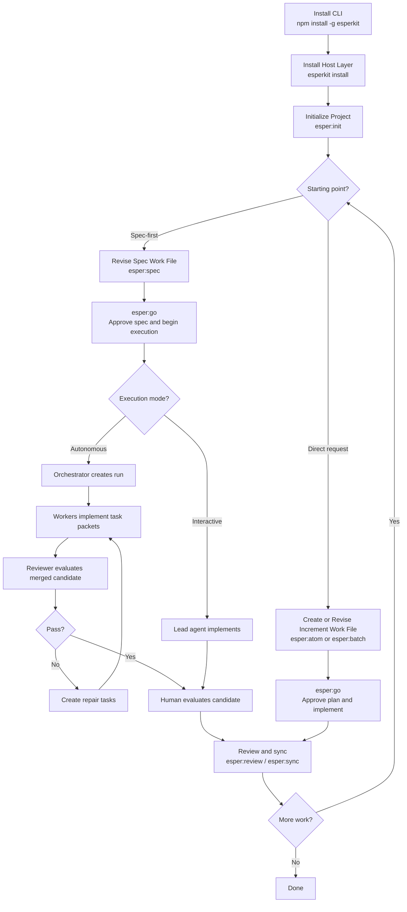

# Workflow Lifecycle

Status: Draft
Date: 2026-03-01

## Source Of Truth

This file is the source of truth for workflow behavior.

## Install And Init

### Global Install

The user installs the CLI toolkit with `npm install -g esperkit`.

### Host Install

The user runs `esperkit install` in the repository to install or update host-specific skills and command assets.

### Project Init

The normal user-facing entrypoint is `esper:init`, which calls `esperkit init` as the deterministic primitive.

Initialization creates:

- `.esper/`
- `.esper/esper.json`
- `.esper/context.json`
- `.esper/WORKFLOW.md`
- `.esper/CONSTITUTION.md`
- `.esper/increments/`
- `.esper/runs/`
- the initial spec tree under `spec_root`
- optional template-backed areas such as `patterns/`

At this point, the spec tree is scaffolding rather than a reviewed description of the current system.

## Spec-To-Code

Spec-to-Code is the primary workflow when the approved spec is the source of truth before implementation.

### Open The Spec Work File

The working file is one or more target spec files, or a temporary coordination file under `<spec_root>/_work/` when staging is needed.

If the agent must first understand unfamiliar code, it may create a temporary linear walkthrough in `_work/` before landing durable conclusions into the spec tree.

The agent must read and resolve user comments in the working file before proceeding.

### Revise The Specs

The user and agent iterate on the spec work file until it accurately describes the desired behavior, architecture, interfaces, and state flows.

Behavior descriptions and scenarios must be easy for the user to inspect when behavior is in scope.

### Approve The Spec And Begin Execution

The user invokes `esper:go` on the approved spec work file.

The agent then:

- reads the approved spec files
- derives one atomic increment or a batch queue
- creates a parent increment as an execution ledger
- begins execution immediately unless ambiguity, conflict, or missing approval is discovered

Rules:

- the approved spec remains the sole source of scope and requirements
- the derived parent increment does not create a second approval gate
- if scope must change, the workflow returns to spec authoring and requires spec approval again

### Execute Against The Approved Spec

For `interactive` execution:

- run the configured baseline test command first when available
- prefer red-green loops for bounded, testable changes
- derive failing tests from approved behavior descriptions or scenarios when practical

For `autonomous` execution:

- freeze the approved spec snapshot and the derived execution ledger
- record the starting validation state when baseline checks are configured
- decompose work into bounded task packets
- preserve approved scope throughout the run
- prefer independently testable packets with task-scoped test expectations

In autonomous runs:

- the approved spec snapshot remains the authoritative scope contract
- the parent increment remains the active human-facing execution ledger
- the reviewer may require explanation artifacts or linear walkthroughs when the code is hard to audit

### Review And Sync

After execution:

- `esper:review` evaluates the implementation against the active increment and relevant specs
- `esper:sync` reconciles shipped behavior back into the relevant spec files

Behavior-changing work must update behavior descriptions and concrete scenarios before close-out.

## Plan-To-Spec

Plan-to-Spec starts from a direct user request.

### Create The Increment Work File

The user starts with `esper:atom` or `esper:batch`.

The active increment file is the planning artifact. In batch mode, the parent increment is the work file and child increments are derived from it.

### Review The Plan

The user and agent revise the increment until scope, verification, file impact, and execution shape are acceptable.

In batch mode, the agent presents a queue preview before execution.

The queue preview shows, at minimum:

- the increments the agent intends to execute
- the planned execution order
- the high-level scope of each increment
- the relevant spec files or sections expected to change
- the expected validation approach
- the planned agent roles for orchestration, implementation, and review when autonomous execution is enabled
- the autonomous stop conditions when autonomous execution is enabled

### Approve The Increment And Implement

The user invokes `esper:go` on the increment work file.

In Plan-to-Spec:

- the increment is the approval artifact
- the coding agent implements against the approved increment
- the same baseline-test-first and behavior-driven red-green preferences apply when the change is testable

### Review And Sync

After implementation, `esper:review` verifies the delivered work and `esper:sync` updates the spec tree.

## Shared Operational Loop

1. Use `esper:context` when state is unclear.
2. Re-establish current state with configured baseline checks before active execution resumes.
3. Create or revise the current Markdown working file.
4. Use `esper:go` to cross the active approval boundary.
5. Let the workflow proactively validate, maintain specs, and emit explanations when review risk is high.
6. Use `esper:review` for explicit implementation review.
7. Use `esper:sync` for post-implementation spec maintenance.

## Artifact State Summary

| Stage | Primary command | Active work file | Created | Changed | Removed or closed |
| --- | --- | --- | --- | --- | --- |
| Global install | `npm install -g esperkit` | None | Global `esperkit` CLI install | None in the repo | None |
| Host install | `esperkit install` | None | Host-specific instruction assets | Existing host-specific instruction assets | Replaced generated host assets when needed |
| Project init | `esper:init` -> `esperkit init` | None | `.esper/`, `.esper/context.json`, `.esper/WORKFLOW.md`, bootstrap docs, increment directories, `.esper/runs/`, spec scaffolding | Project config state | Replaced generated scaffolding only when explicitly requested |
| Spec authoring | `esper:spec` | Target spec file(s) or `<spec_root>/_work/<topic>.md` | Temporary `_work` file when needed | Active spec work file and relevant spec files | Temporary `_work` file after landing |
| Spec approval to execution | `esper:go` on a spec work file | Approved spec work file | Derived active increment and optional pending batch items | `.esper/context.json` and active increment work file(s) | None |
| Plan revision | `esper:atom` / `esper:batch` | `.esper/increments/active/<id>.md` | Pending child increments in batch mode | Active increment and pending children | Superseded pending children when the queue changes |
| Interactive execution | `esper:go` on an interactive increment | `.esper/increments/active/<id>.md` | Commits and PR artifacts when configured | Source files, active increment, and relevant specs when behavior changes | None |
| Autonomous execution | `esper:go` on an autonomous increment | `.esper/increments/active/<id>.md` | Run records, task packets, review records, isolated branches or worktrees, commits | Source files, active increment, run artifacts, and relevant specs when behavior changes | Superseded task packets as repair rounds advance |
| Human evaluation and review | `esper:review` | `.esper/increments/active/<id>.md` | None | Active increment with findings or sign-off notes | None |
| Post-implementation spec sync | `esper:sync` | `.esper/increments/active/<id>.md` | None | Relevant specs, active increment, and `.esper/context.json` when the increment advances | Active increment moved to done, later archived by retention policy |

## Flowchart

